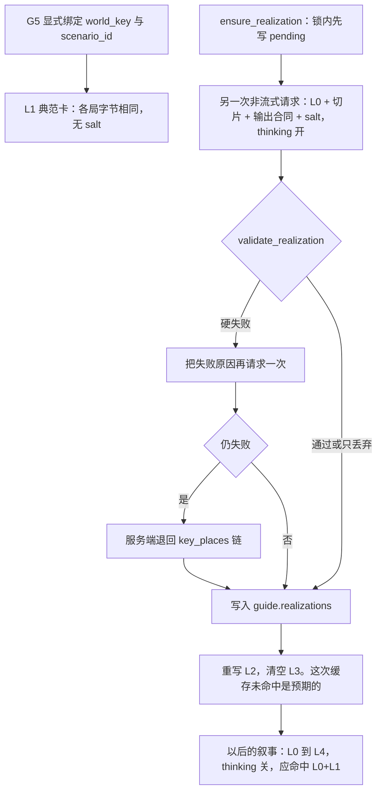
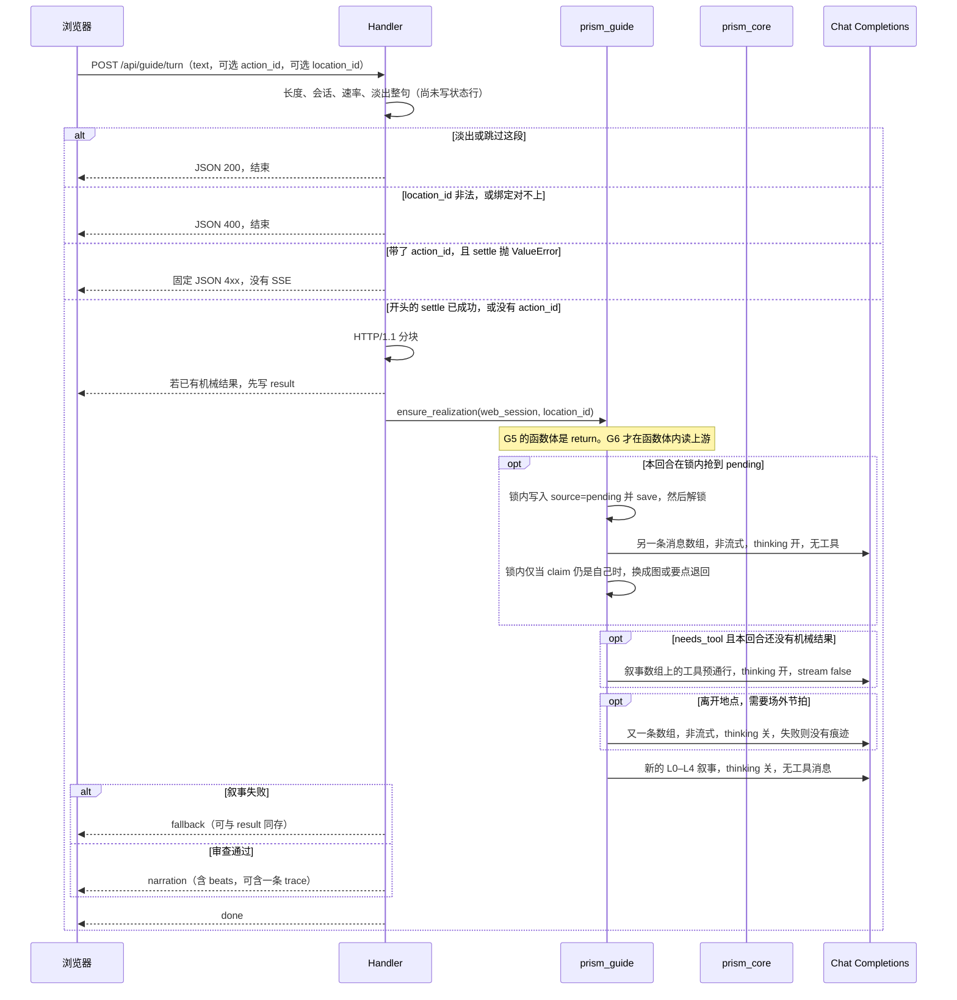

# 导引者 · 模型用来把一场剧本走成不同的一局 · 设计方案

> 状态：Draft。本文只定设计与拆单，不含实现。
> 日期：2026-10-09。
> 读者：主管 Agent。审过之后按文末「PR Plan」拆成 Issue，再指派实现 Agent。
> 预定落点：仓库根 `GUIDE-DESIGN.md`（替换同名草案，不另起文件名）。未进 GitHub 之前，按 `AGENTS.md` 不能当作交接。
> 依据：同日已拍板的模型、音色、pcm16 与环境变量；本修订把「模型到底用来做什么」写成前两页。默认分支是 `master`。

本文件不是规则正文，不替代 `docs/system/04-conductor-os.md`。规则真相仍在 `prism_core.py`。模型不掷骰。地图坐标仍归 ATLAS，导引者不接过编译器。

本文是上一版导引者草案的修订，不是另起一套接口。上一版已经钉死的工程（Chat Completions、前缀缓存、pcm16、薄回合循环）全部保留。新用途若和那些句子打架，**不删旧句子**，只加到后面的切片，并在文中写明「这是延伸，不是推翻」。

---

## 0. 主管怎么用这份方案

1. 先读第 2 节。那是模型存在的理由。再读文末 **Key Decisions**。模型、音色、pcm16、三个环境变量名、走哪条 HTTP 接口，都不要再开成问题。
2. 第 5 节是线路。不同意风险表里的某一条，先改本文再拆单。
3. 文末 **PR Plan** 的 G0–G7 可以照抄开 Issue。G1–G4 仍是管道，不要和 G5–G7 揉成一条。
4. 开单时打上每条写明的难度标签与能力标签。可改 / 禁改路径不要放宽。
5. 实现 Agent 不合并。审查用四行建议。
6. **2026-10-09 再次用 `gh` 核对（开单当天还要再查，不要沿用这段）。**
   - **#64**（I2）**CLOSED**。对应 PR **#79** 已 **MERGED**（`mergedAt` 2026-10-09T06:10:39Z，`feat/atlas-i2-compile`）。不要写成还在审，也不要写成开放的 Draft。
   - 仍 **OPEN** 的 Issue：**#65**（I3）、**#66**（I4）、**#67**（I5）、**#68**（I6）。
   - 开放 PR 有两份，都是 Draft，不是一份：
     - **#80** `feat/atlas-i6-place-id`（对 #68）。文件：`data/FORMAT.md`、`data/scenarios/` 下各剧本（含 `yunji.json`）、`tests/test_atlas_ledger_pins.py`。yunji 上只给账本模板的 NPC 与地点加 `place_id: null` 和 `pinned: false`，不改白壁、绳会账房、霍砚。**不改** `notdnd_web.py`，**不改** `MASTER.md`。
     - **#81** `feat/atlas-gen`（对 #65）。文件只有 `atlas_gen.py` 与 `tests/test_atlas_gen.py`。**不改** `notdnd_web.py`、`MASTER.md`、`prism_guide.py`、`data/scenarios/**`。
   - 此刻没有改 `MASTER.md` 的开放 PR，G0 可以开。#66、#67 还只是 Issue，没有改 `notdnd_web.py` 或 `prism_core.py` 的开放 PR，所以 G2 / G5 目前不撞 `notdnd_web.py`。一旦出现那样的 PR，G2 / G5 就要等。
   - G5–G7 **不改** `data/scenarios/**`（#80 开着时尤其不能改），也**不改** `atlas_gen.py`（#81 开着时尤其不能改）。
   - 种类词不准写进 `data/atlas/lexicon.json`，因为它是 ATLAS 的数据。#79 已经在 `master` 上，不是因为它还在审。

---

## 1. 概述（Overview）

玩家把这一局的焦点放进**白壁**。存档当场长出一张可以在文字里走的街道图：白房子、洗墙的巷、拍卖厅和它下面的地库都在，名字与剧本卡片一致，多出来的巷子也扣得住「墙每月洗一次、这里是老钱」。**霍砚**开口时顺着他的欲望说话，不把那句秘密说出来。同一份世界、同一份剧本再开一局，白壁仍叫白壁，灰市里仍有绳会账房，但街道、多出来的屋子、街角的人、先碰到哪条既有钩子、对白怎么说，都是另一套。剧情节点骨架不换。

这件事靠可选模块 `prism_guide.py`，不是靠改写 `data/scenarios/yunji.json`。线路仍是小米 MiMo 的 **OpenAI Chat Completions**（`POST {BASE_URL}/chat/completions`）：`mimo-v2.6-flash` 写实相、场外节拍和【裁决】【叙事】【钩子】，`mimo-v2.5-tts` 把已经定稿的节拍读成流式 **pcm16**。音色只用 **白桦** 与 **茉莉**。规则骰子只来自 `prism_core.perform_action`。没有密钥、模块缺失、超时或上游失败时，对局继续，浏览器只看到固定兜底，或退回地点卡上那几条 `key_places`。

第 2 节写用途。第 5 节写线路，包括前缀怎么排才不会被实相打穿。

---

## 2. 模型用来做什么

三件事。都对着本仓库里已经有的字段，不另造一套世界观，也不把 `docs/` 贴进提示词。G1–G4 **不做**这三件；它们只铺管道。G5、G6、G7 才做，而且不做的时候，管道的验收一句不改。

### 2.1 用途一 · 把一座城读成可走的地方

今天一张剧本 `location`（`data/schema/scenario.schema.json` 的 `location`）是一张卡片：`atmosphere`，加上大约五条 `key_places` 字符串，另有可选的 `unlock`、`if_botched`。`data/scenarios/yunji.json` 里的白壁（`loc-02`）、灰市（`loc-05`）、中庭（`loc-03`）都是这个形状。世界 `region`（`data/schema/world.schema.json`）在世界尺度上同样是卡片：`summary`、`atmosphere`、`key_places`、`powers`。两边都**不是**街道图。

ATLAS（`ATLAS-DESIGN.md` §1 与 §3 导言）从世界 JSON **编译几何，不调用模型**。同文件写明：导引者以后只读「地点卡」，不读整张图。`atlas.guide_card` 的实现也只返回当前地点、帧的尺度和出口。**导引者不得接过 `atlas_compile.py` / `atlas_gen.py`，不得改它们的算法，不得把实相节点写回帧。**

模型的工作叫**实相**。这一局**第一次**把焦点放进一个大地点时，生成一张导引者说得出口、玩家用文字走得动的地点图：

- 街、建筑、富区、贫区、下层（下水道或这个设定里等价的底下那一层）
- 每个节点有稳定 id、父地点（典范地点 id）、闭集里的种类、一句事实、以及到其他节点的链接
- **印证是强制的。** 每个节点必须引用它靠着的典范字段：`atmosphere`、某一条 `key_places`、一条术语、一个势力名，或区域 `summary`。与典范专名、某条 `key_places`、NPC 的 `drive` / `secret`、或世界术语含义相抵的节点**丢掉，不写进叙事**
- 典范 `key_places` **全部**要成为节点。模型可以在它们周围加结构。不得改名。白壁仍叫白壁，绳会账房仍叫绳会账房。不得删 `unlock`，不得删 `if_botched`
- **不向模型要 x、y、z。** 坐标归 ATLAS。实相只有名字、种类和链接。内存里若已经有带 `places` 的运行时帧，导引者仍用 `guide_card` 读队伍所在那一格的地点卡；实相不得再发明第二套坐标系。没有帧时，玩家就走这张文字图，直到 ATLAS 的帧出现
- **每个（存档，典范地点 id）只生成一次**，落在 `guide.realizations[location_id]`。读上游之前先在锁里写下 `source: "pending"` 的占位（第 5.2 节），避免两个回合一起画。之后的回合读这份 JSON，**不再**叫模型重画这座城。重画会拆掉连续性，也会拆掉前缀缓存
- 这次调用**不是**叙事调用，也不是工具预通行。它是 `ensure_realization` 里的另一条消息数组：非流式，`thinking.type` 为 `enabled`，`max_completion_tokens` 为 **4096**，不带工具。输出形状、六种 `kind`、id 语法、以及这一处的专名清单，都写在**这次的 user 消息**里，不写进 L0。L0 仍是叙事宪法，这条 user 消息要写明：忽略三段标题，不要输出【裁决】【叙事】【钩子】。校验失败再请求**一次**；仍然失败，就退回典范卡片本身（那几条 `key_places`），对局仍可玩，并且把这份退回也存上，避免下一回合再画
- 提示词里的典范文本 = 这一张地点卡 + 一小片世界（世界名、引擎、最多 8 行术语、对得上的父区域）+ 上面的输出合同。不贴 `docs/`，不贴整份 `yunji.json`。典范切片（不含输出合同）上限 **4000 字**（每个码位算一个字）

**什么叫走进一个地点。** `RuleSession.scene.id` 不是战役节点，也不能当成「人已经站在白壁」。战役节点在剧本 `nodes[]`（例如 `whitewall`「二阶·白壁」、`V0`「绳会账房的后间木匣」）。本方案不生成、不改写那张节点图。焦点是显式的：`POST /api/guide/turn` 可以带 `location_id`，它必须等于已绑定剧本里某个地点的 `id`。对不上，在状态行之前 400，错误文案 `没有这个地点`，不叫模型。不带这个字段，就不换焦点、不生成实相。禁止从玩家散文里猜「他是不是进了白壁」。

**大地点。** schema 没有尺寸字段。凡是有非空 `key_places` 的典范地点，第一次聚焦都生成实相。节点上限是「全部要点 + 至多 8 个加出来的节点」。要点再多也不得删。yunji 的地点卡（白壁、灰市、中庭）就是要被读成可走的地方的那种卡片，不再按名字做特例。

**和 ATLAS 同时存在时。** 实相节点没有坐标。`read_place_card` 的行为与上一版相同：只有帧里真有 `places` 才调用 `guide_card`，工具结果只留地名、出口名、一句尺度。若那张地点卡的 `name` 与某个实相节点的 `name` 逐字相同，服务端把 `guide.here` 放到该节点上，不调用模型，也不写坐标。对不上就各走各的：文字图用 `here`，地图用 locus。不把实相链接喂进编译器去「对齐」。

**文字里怎么走。** 纯函数，不叫模型：

```python
def resolve_step(realization: dict, here: str, text: str) -> str:
    """只在 here 的相邻节点里走，不改 location_id，不纠正错字。

    1. text.strip() 与某一个相邻节点的 name 逐字相等：走到那个节点。
    2. 否则收集 name 至少 2 个码位、并且作为子串出现在 text 里的相邻节点。
       若其中有一个名字严格长于其他命中，走到它。
       一个都没有，或有两个并列最长，留在 here。
    """
```

「去洗墙巷」「我走到听泉馆」因此走得动：相邻名字至少 2 个码位，而且全文里这样的名字恰好一个。命中多于一个时，只有一个名字严格长于其余每一个才走（它就是唯一的最长名）；并列最长留在原地，所以「从洗墙巷去听泉馆」不动。不纠正错字。禁止从正文推断新的 `location_id`：这句话不把焦点从白壁改到灰市。焦点仍然只认请求体里的 `location_id`。

生成完成后，`here` 初始放在第一条要点（`key_places` 数组顺序）上。没有完成的实相（还是 `pending`，或这一回合不是占位的主人）时，不调用 `resolve_step`，`here` 不动。

**专名怎么从 `key_places` 切出来。** 条目是一整句，专名是第一个全角破折号 `——` 之前的子串；没有破折号就用整串，去掉两端空白。白壁五条必须逐字是：

| 专名 |
|---|
| 听泉馆 |
| 白壁行拍卖厅 |
| 白壁行地库 |
| 回声匣保管室 |
| 老园丁小屋 |

灰市第一条的专名是 `绳会账房`，不是后面的「温苔的地盘」。战役节点名 `绳会账房的后间木匣` 是另一条字符串，实相节点不得占用它。

**种类闭集**（只有这六个字）：`街`、`建筑`、`富区`、`贫区`、`下层`、`要点`。`要点` 只留给典范专名本身。

**白壁不放贫区。** 这张卡的氛围写的是「这里是老钱，不喧哗」。贫区若只靠这句，与设定相抵，节点丢掉，不写进叙事。下层用卡上已有的地库，不另造一条和地库矛盾的下水道，也不另造坐标。灰市、沉巷的卡片没有「老钱」这句，贫区只要引用了它们自己的句子就可以留下。这是印证，不是按城市名写死的分支。

**存档里的一份实相（示意，不是实现）。** 五个要点的专名与文件逐字相同。洗墙巷、老钱排屋、地库坡道、滴水口是本方案起的结构名，用来说明「加在要点周围」，不是新的典范。`unlock` 与 `if_botched` 由服务端从卡片抄上。模型改了或省略了这两段，都不把整张图判死，抄上去的仍是典范原文。

```json
{
  "version": 1,
  "location_id": "loc-02",
  "location_name": "白壁",
  "source": "model",
  "preserved": {
    "unlock": "flag.rep_baihang ≥ 0，或持白壁行邀请函；否则须经外墙（檐行者，潜行 DF 16）。",
    "if_botched": "白壁行对全城发出「拒收通告」，此后 1d4 周内所有赃物折价率 −20%；声望（白壁行）−3。"
  },
  "nodes": [
    {
      "id": "loc-02/tingquan",
      "parent": "loc-02",
      "kind": "要点",
      "name": "听泉馆",
      "fact": "西翼有泉，泵一响就能盖住脚步。",
      "cites": [{"field": "key_places", "ref": "听泉馆"}],
      "links": ["loc-02/old-money"]
    },
    {
      "id": "loc-02/auction",
      "parent": "loc-02",
      "kind": "要点",
      "name": "白壁行拍卖厅",
      "fact": "洗印和拍卖在同一座厅里。",
      "cites": [{"field": "key_places", "ref": "白壁行拍卖厅"}],
      "links": ["loc-02/old-money", "loc-02/vault-ramp", "loc-02/echo-box"]
    },
    {
      "id": "loc-02/vault",
      "parent": "loc-02",
      "kind": "要点",
      "name": "白壁行地库",
      "fact": "模具和待洗的东西在厅的下面。",
      "cites": [{"field": "key_places", "ref": "白壁行地库"}],
      "links": ["loc-02/vault-ramp"]
    },
    {
      "id": "loc-02/echo-box",
      "parent": "loc-02",
      "kind": "要点",
      "name": "回声匣保管室",
      "fact": "恒温，供电单独走。",
      "cites": [{"field": "key_places", "ref": "回声匣保管室"}],
      "links": ["loc-02/auction"]
    },
    {
      "id": "loc-02/gardener",
      "parent": "loc-02",
      "kind": "要点",
      "name": "老园丁小屋",
      "fact": "阿宓住在这里，换班表在屋里。",
      "cites": [{"field": "key_places", "ref": "老园丁小屋"}],
      "links": ["loc-02/wash-lane"]
    },
    {
      "id": "loc-02/wash-lane",
      "parent": "loc-02",
      "kind": "街",
      "name": "洗墙巷",
      "fact": "一排白房子之间的窄巷，墙按月刷白。",
      "cites": [{"field": "atmosphere", "ref": "每月洗一次"}],
      "links": ["loc-02/gardener", "loc-02/old-money", "loc-02/drip"]
    },
    {
      "id": "loc-02/old-money",
      "parent": "loc-02",
      "kind": "富区",
      "name": "老钱排屋",
      "fact": "面朝崖外的一排房子，夜里安静。",
      "cites": [{"field": "atmosphere", "ref": "这里是老钱"}],
      "links": ["loc-02/tingquan", "loc-02/auction", "loc-02/wash-lane"]
    },
    {
      "id": "loc-02/vault-ramp",
      "parent": "loc-02",
      "kind": "下层",
      "name": "地库坡道",
      "fact": "从拍卖厅往下，接到地库，不是另一座城。",
      "cites": [{"field": "key_places", "ref": "白壁行地库"}],
      "links": ["loc-02/auction", "loc-02/vault"]
    },
    {
      "id": "loc-02/drip",
      "parent": "loc-02",
      "kind": "建筑",
      "name": "滴水口",
      "fact": "后墙外机滴水的那个拐角。",
      "cites": [{"field": "atmosphere", "ref": "空调外机的滴水声"}],
      "links": ["loc-02/wash-lane"]
    }
  ],
  "people": [
    {
      "id": "inc-7c3a91e2",
      "at": "loc-02/wash-lane",
      "manner": "每月来刷白墙，问话只答还没干。",
      "secret": ""
    }
  ]
}
```

链接在校验时做成双向：甲连乙则乙也连甲。模型写出的单向边补全，不另叫一次模型。`people[].id` 由服务端生成，模型给的 id 丢掉。见第 2.2 节。

**印证校验器是纯函数。** 不读盘，不访问网络。G6 的测试直接喂字典。

```python
def validate_realization(
    realization: dict,
    canon: dict,
) -> tuple[dict | None, list[str]]:
    """返回 (可落盘的实相或 None, 原因列表)。

    原因以「失败：」开头时，第一个元素必须是 None。
    原因以「丢弃：」开头时，该节点已从返回的实相里去掉；
    若因此缺了要点，再追加一条失败，并把实相改成 None。
    列表为空且实相非 None，才可以 save。
    """
```

`canon` 至少含这些键（都是调用方已经从 JSON 里摘好的短字段，函数自己不打开文件）：

| 键 | 含义 |
|---|---|
| `location_id` / `location_name` | 如 `loc-02` / `白壁` |
| `key_place_heads` | 专名列表，顺序与数组一致 |
| `key_place_full` | 原串，供 `ref` 做子串比对 |
| `atmosphere` / `unlock` / `if_botched` | 卡片原串；后两个可为空串 |
| `glossary` | 至多 8 条 `{term, meaning}`，可以是空列表 |
| `region_summary` | 对得上的区域摘要，或空串 |
| `factions` | 短名字列表，不是势力长文 |
| `npc_names` | 剧本 NPC 的 `name` |
| `npc_secrets` | `{npc_id: secret}`，用完整秘密，不用截断 |
| `forbidden_names` | 其他地点名、战役节点名、NPC 名 |

硬失败只来自整张图，原因是稳定中文，测试按子串断言。多一个近名、或多一条指向已丢节点的边，**不**把整张图判死：

| 原因 | 何时 |
|---|---|
| `失败：改了典范名：{看到的名字}` | `location_name` 与典范地点名不逐字相等；或某个 `kind==要点` 的 `name` 不是任一专名 |
| `失败：缺少要点：{专名}` | 某个专名没有作为 `kind==要点` 且 `name` 逐字相等的节点出现 |
| `失败：无引用：{节点 id}` | 任一节点的 `cites` 缺失、为空，或 `ref` 在声明的字段里找不到 |
| `失败：种类不对：{节点 id}` | `kind` 不在闭集里 |
| `失败：父地点不对：{节点 id}` | `parent` 不是这次的地点 id，或 id 不匹配 `^{地点 id}/[a-z0-9-]{1,24}$` |
| `失败：只有要点` | 丢弃之后，没有任何一个节点的 `kind` 不是 `要点` |

没有 `失败：链接越界`。没有 `失败：删了 unlock`。模型若带了 `unlock` 或 `if_botched`，丢掉模型的那份，服务端从典范抄上。省略也不算删。抄上去的字符串玩家以后仍能对上卡片，模型改一个字也盖不掉。

丢弃只拿掉那个节点，然后删掉所有指向已删除 id、或指向本来就不存在的 id 的边。删边不是失败，也不触发重试。

| 原因 | 何时 |
|---|---|
| `丢弃：{id}：撞了别人的名字` | 非要点节点的 `name` 等于某个 NPC 名、另一处地点名或战役节点名。要点若就是规定专名，不丢 |
| `丢弃：{id}：近名` | 非要点节点的 `name` 与某条专名、地点名或战役节点名：去空白后相等但原文不等；或等长且恰好一个码位不同（`白璧` 对 `白壁`）；或一方是另一方的子串且长度差 ≤ 1（`白壁巷` 对 `白壁`，`听泉馆外` 对 `听泉馆`） |
| `丢弃：{id}：写了秘密` | `fact` 含任一 NPC `secret` 的全文，或其中连续 **8** 个码位 |
| `丢弃：{id}：与术语含义相抵` | 引用了某条术语，且 `fact` 在该术语 `meaning` 的连续 4 字之前 4 字以内出现「不是」「并非」或「没有」 |
| `丢弃：{id}：和老钱矛盾` | `kind==贫区`，且所有引用句所在的典范字段含「老钱」，同时这些引用句不含贫区词 |
| `丢弃：{id}：种类没有印证` | `富区` / `贫区` / `下层` 的引用句里没有该种类的印证词 |

要点的名字必须逐字等于专名，差一个字是整张图的 `改了典范名`，不是丢弃。加出来的节点差一个字只丢那个节点。长度差 ≥ 2 的延伸名可以留下，例如洗墙巷。战役节点全名 `绳会账房的后间木匣` 落在 `forbidden_names` 里，加出来的节点若直接用这个全名，按「撞了别人的名字」丢掉；五个要点还在，而且若还有街或建筑，图就留下。若因此没有任何节点叫 `绳会账房`，再失败为 `缺少要点：绳会账房`。

**只有要点是硬失败。** 模型只交回五条要点，或交回的街、贫区在丢弃之后一个不剩，都是 `失败：只有要点`。这一次重试的 user 消息必须再次列出输出形状、六种 kind、id 语法和专名，并写明还要有街、建筑、下层，引用必须来自切片。**不要求贫区。** 卡片上能撑住贫区的句子会被「和老钱矛盾」丢掉时（白壁的氛围就是这种），重试要写明不要为了凑种类去输出贫区。服务端自己造的 `source: "fallback"` 可以只有要点，它不再过「只有要点」这一条，否则退回本身会被判死。

硬失败才重试一次。只发生丢弃、而且丢完之后还有至少一个非要点节点，就存这张图，**不再**为了把丢掉的巷子画回来而二次请求。重试把原因列表放进这次请求的**最后一条** user 消息，不写进 L0。第二次仍失败：服务端自己造 `source: "fallback"` 的实相，不经过模型——每个专名一个要点，`fact` 就用专名本身，按数组顺序串成一条链，`people` 为空，`unlock` / `if_botched` 照抄。这份也写入 `guide.realizations[location_id]`。同一地点不再生成。

**印证词**（写在 `prism_guide.py` 的元组里，**不**写进 `data/atlas/lexicon.json`）：

| 种类 | 引用句里至少要有其中一个 |
|---|---|
| 富区 | 钱、富、宅、拍卖 |
| 贫区 | 贫、棚、租、陋、檐、工人、下水道 |
| 下层 | 地、井、渠、排、涝、渗、库、下层 |

`街` 与 `建筑` 不套这张表，只要引用合法。`要点` 的 `cites` 必须是 `field==key_places` 且 `ref` 与该节点 `name` 逐字相等。

**引用合法**：`field` 只能是 `atmosphere`、`key_places`、`glossary`、`faction`、`region_summary`。`ref` 非空。`key_places` 的 `ref` 要么等于某条专名，要么是该条原串里连续至少 4 个码位。其他字段的 `ref` 必须是该字段文本的连续至少 4 个码位（术语则 `ref` 等于 `term`）。找不到即 `无引用`。

**典范切片（实相请求用，不是 L1）。** 地点卡只放 `name`、`atmosphere`、`unlock`、`key_places` 原串、`if_botched`。不放 `encounters`、`resources`、`source`。世界切片只放：世界显示名、`engine`、按 `term` 排序的至多 8 行 `术语：含义`、至多一条区域 `summary`（先截到 200 字）。区域主名是 `name` 里全角 `｜` 之前的部分（与 `ATLAS-DESIGN.md` 相同的切法）。主名等于地点名，或主名包含地点名，才算对上；多个时取得最长的主名。对不上就不放区域，禁止挑一个「看起来像」的。

`yunji.json` 的 `meta.world` 是 `yunji`，仓库里**没有** `data/worlds/yunji.json`（现有世界文件是别的 `key`）。因此云脊这场的实相请求里术语为零行，区域摘要为空。不得去借另一份世界的术语来「凑满 8 行」。

4000 字不够时，先截 `atmosphere` 的尾部。地点名、专名、`unlock`、`if_botched` 永不截断。仍超限就截区域摘要。再超限就少带术语，从排序的末尾丢。

### 2.2 用途二 · 角色行为与对白

剧本 NPC（schema 的 `npc`）已经有 `drive`，以及可选的 `lever` / `mask` / `tell`、`secret`、`attitude.affinity` / `awe`、`knows`、`if_dead_or_betrayed`。导引者操作系统第 8 节把前四项称为 Drive / Lever / Mask / Tell。模型**扮演**这些字段，不替换它们。

**两套驱动文本，只认 npc 对象上的那一套。** `yunji.json` 的 `npcs[]` 里，霍砚（`npc-01`）的 `drive` 是「在两年内把九枚权钥凑齐……」，`secret` 是他与计霜、第一枚权钥的那句。同文件 `ledger_template.npcs[]` 里同名条目的 `drive` 是缩短过的另一句，并且 mask / lever / tell 写在那里，不在 `npcs[]` 上。印证与提示词里的 **drive / secret 只取 `npcs[]`**。mask / lever / tell：npc 对象上有就用对象上的；没有才用账本模板里**同名**的那一条。模板里的短 drive **不**进入提示词，也**不**当成「与典范矛盾」的对照句。`if_dead_or_betrayed` 只取 `npcs[]`。

**场外一拍的触发。** `scene.id` 不是战役节点。`RuleSession.scene` 今天是 `{id: "", actions: []}`，G5–G7 不改 `prism_core.py`，因此也不会去写这个 id。场外节拍用玩家真的会碰到的事件：

- **主触发：** `guide.focus_location_id` 从一个典范地点变成另一个。离开的那一处，每个「在场」的具名 NPC 可以有**一条**场外节拍，顺着 `drive`。
- **原检查点仍有效：** `rules["scene"]["id"]` 若变成另一个字符串，同样记一轮。测试可以直接改快照来触发。G5–G7 自己不写这个字段。
- 同一回合两件事都发生，只记一轮。

「在场」：`guide.npc_at[npc_id]` 等于这个地点 id；或者绑定之时按账本模板填的 `guide.npc_home` 等于这个地点。模板的 `location` 字符串**包含**地点 `name` 才算家：霍砚的「二阶白壁行」含「白壁」，所以家是 `loc-02`；温苔的「五阶灰市」含「灰市」，家是 `loc-05`。多个地点名都能嵌进去时，取得最长的地点名。没有模板条目的 NPC，只有在这个地点说过话（对白节拍把 `npc_at` 写成当前焦点）之后才算在场。

一轮最多 **4** 条，按 `npc_id` 字典序取前 4。不按 salt 丢掉典范人物。

节拍存进 `guide.traces`，**事后**当痕迹揭开，不写成场外独白（守则四）。揭开的时机：到达新地点后的**下一**次叙事，至多揭开一条 `at` 等于新地点、且尚未揭开的痕迹。揭开的句子放在叙事事件的 `trace` 字段，由服务端写，不要求模型再演一遍。L0 写明：不在场的事只留痕迹。

`guide.npc_flags[id]` 为 `dead` 或 `betrayed` 时，**不叫模型**，痕迹就是 `if_dead_or_betrayed` 的原文。G5–G7 没有把人标死的规则入口；这个标志只由测试或以后的规则 Issue 写入。典范原文优先于任何生成节拍，哪怕原文里带有情节后果。

场外请求也**不是**叙事数组：非流式，`thinking.type` 为 `disabled`，温度 0.7，`max_completion_tokens` 512。一次请求覆盖这一轮的至多 4 人，返回 JSON。失败、超时、校验不通过：这一轮没有痕迹，叙事照常，不走「导引者不在席」那句兜底。不重试。

**场内对白**是一条节拍，`speaker` 等于 npc id。句子必须与 `mask` 一致（他拿出来给人看的那一面），并且不得主动说出 `secret`，除非下面的杠杆条件成立。服务器无法用正则证明「这句违背了 drive」。不假装能证明。对白**可以点出另一名典范 NPC 的名字**。温苔可以说「霍砚」。卫铮能否提到岑照，不取决于 drive 字符串里碰巧有没有这个字。地点节点不得占用 NPC 的名字，那条仍在第 2.1 节的 `丢弃：撞了别人的名字`，不挪到对白上。

窄检查只查秘密，不查「这句话里有没有别人的名字」：

```python
def check_speech(
    line: str,
    speaker: dict,
    *,
    secret_allowed: bool,
) -> str | None:
    """通过返回 None。否则返回 `写了秘密`。
    不判断面具像不像，不判断欲望是否被反着说，
    不因为出现了另一名 NPC 的 name 而失败，不调用模型。"""
```

- `写了秘密`：`secret_allowed` 为假，且 `line` 含该 NPC `secret` 全文，或其中连续 8 个码位。全文来自剧本文件，不用 L1 的 120 字截断。

玩家将要看到的叙事不靠「切得出对白拍」才受这道门。骰子审查之后、写入 L3 和 `last_beats` 之前，对整段叙事（正文和钩子）调用：

```python
def redact_secrets(text: str, secrets: list[tuple[str, bool]]) -> str:
    """secrets 是 (全文, allowed) 列表，每个已绑定 NPC 一条。
    全文来自剧本文件，不用 L1 的 120 字截断。
    allowed 为假时，把全文以及其中每个连续 8 码位换成「……」。
    先替换较长的命中。不调用模型。allowed 为真的那一条不替换。
    """
```

`allowed` 与下面的 `secret_allowed` 是同一个条件。没有冒号和引号的旁白也过这道门，所以「霍砚低声说他是守钥人计霜的儿子」不会整句进 L3。节拍从涂掉之后的正文切。涂掉之后去掉空白若为空，正文用既有兜底句，裁决仍是服务端的句子。不再为了涂掉秘密去叫第二次模型。

`secret_allowed` 为真，当且仅当下面二者之一：

1. 本回合玩家原文里出现该 NPC 的 `lever` 整段，且 lever 至少 4 个码位。霍砚的 lever 在模板里是「他是计霜的儿子」；玩家把这句说出来，这一回合允许秘密进入他的对白。
2. `guide.known_clues` 与该 NPC 的 `knows`（例如霍砚的 `C-01`、`C-04`、`C-09`）有交集。

G7 **不**把线索自动标成已知。`known_clues` 只由测试或以后的规则 Issue 写入。顶层 `threads[]` 的 `name` 才是线索专名（C-01 是「九枚权钥各对应一座柜……」）。`ledger_template.threads` 里的短名（C-01 写成「九钥是什么」）不进提示词，避免两套专名。L4 可以提示「本回合可碰到的既有钩子」是哪一条顶层专名，这不把 `known_clues` 加上，也不等于允许说秘密。

叙事里的秘密命中只换成「……」，不把整拍改成「没有接话」，也不第二次叫模型。场外节拍若 `check_speech` 返回 `写了秘密`，这条痕迹不存。`if_dead_or_betrayed` 的原文不经过 `check_speech`，也不做 `redact_secrets`。霍砚的 lever「他是计霜的儿子」是 7 个码位，不是他那条秘密的连续 8 码位：秘密以「他是守钥人计霜的儿子」起头，中间多了「守钥人」。玩家把 lever 说出来才把 `secret_allowed` 设为真，不是因为这 7 个字本身已经等于秘密的一段。

**声线。** 对白节拍进 TTS，走已经定下的 `POST /api/guide/speak`。旁白和没有说话人的句子仍是白桦。一个具名 NPC 在**这一局**里只用一个音色：按 `npc.id` 的稳定函数分配白桦或茉莉，写进 `guide.voices`，之后即使函数改了也不重算。

```python
def npc_voice(npc_id: str) -> str:
    """FNV-1a 32 位。低位为 1 则茉莉，否则白桦。
    不读名字，不读代词，不读性别。空 id 不调用，调用方用白桦。"""
    h = 2166136261
    for byte in npc_id.encode("utf-8"):
        h ^= byte
        h = (h * 16777619) & 0xFFFFFFFF
    return "茉莉" if (h & 1) else "白桦"
```

对照（给测试锁死，**不是**性别表）：`npc-01` 霍砚 → 白桦；`npc-02` 温苔 → 茉莉。换一个 id 就会换结果。不得把这个对照写进 `data/`，不得因此给 NPC 加 `voice` 或 `gender` 字段。

**路人不是剧本 NPC。** 实相可以带至多 4 个路人。服务端用 salt、地点 id、所在节点 id 和 manner 做 SHA-256，取前 8 位十六进制，前缀 `inc-`。这个前缀不可能等于 `npc-01`。碰撞就改用摘要的接下来 8 位，前缀不变。路人只有一句 manner，`secret` 必须是空串。manner 里若出现 `C-` 加两位数字，或任一 NPC 秘密的连续 8 字，这个路人丢掉。路人的 id **不能**满足任何战役 `knows`：不写入 `known_clues`，不出现在线索的承载者里。他们的声线同样用 `npc_voice`，第一次写入 `guide.voices`。

### 2.3 用途三 · 同一世界、同一剧本，每次不同

相同的 `world_key` + 同一份剧本文件，必须能玩出不同的一局。差异在**存档**上，不改已经发布的 JSON。

| 各局相同（印证的来源，也是各局共享的缓存前缀） | 各局不同 |
|---|---|
| 世界术语切片、剧本 id、地点名、`key_places` 专名 | 要点周围的街道图、多出来的哪一座建筑 |
| NPC 的 id / 名字 / drive / secret | 街角的哪个路人、对白的措辞、哪一条场外节拍发生了 |
| 战役节点的 id 与名字 | 哪一条**既有**钩子先被 L4 点到 |

两局灰市都有绳会账房。新的一局掷出新的 salt，因而有新的实相。同一局重启之后实相不变，因为 `Session.save()` 会把 `guide` 落盘，加载时原样读回。

**战役节点图不重新生成。** 「截然不同的体验」是空间、走法和谈话，不是另一副剧情骨架。这是决定，不是未决问题。若以后要让节点图本身每局不同，那是另一条 Issue，而且会改内容；本方案不做，实现 PR 也不改 `docs/` 和 `data/scenarios/`。

钩子的「先碰到哪一条」只是提示顺序：把顶层 `threads[].id` 按 id 排序得到固定列表，下标是 `(int(salt, 16) + guide.stats.calls) % 条数`。L4 写一行 `本回合可碰到的既有钩子：{该条的 name}`。不发明钩子，不重排 `nodes[]`，不把这个下标写进 L2（它每回合变，只能待在 L4）。

salt 存在 `guide.salt`：`secrets.token_hex(16)` 的 32 位十六进制，在 `Session.__init__` 为**新**存档生成一次，加载时沿用，空了才补，绝不轮换。salt 进入实相请求，也进入 L2。**不进入 L0。** L0 各局相同，L2 允许各局不同。



---

## 3. 背景与动机（Background & Motivation）

### 3.1 现在已经有的

| 事实 | 落点 |
|---|---|
| 规则函数只返回结构化结果，叙事归调用方 | `prism_core.py`。`perform_action` 一次调用完成结算。`judge_check` 把总分归入五档。`OUTCOMES` 是公开元组。 |
| 玩家不得提交骰值、伤害、资源增减 | 同文件权限边界。绕过 `perform_action` 是旁路。 |
| HTTP 是标准库 `ThreadingHTTPServer` | `notdnd_web.py` 的 `Handler`。基类 `protocol_version` 默认 **HTTP/1.0**。请求体上限 2MB。 |
| 存档容器不是活的规则会话 | `Session.rules` 是快照字典。`perform_action` 要的是 `RuleSession`。直接传入 `Session` 或 `session.rules` 会失败。 |
| `scene` 不是战役节点 | `RuleSession.scene` 初始 `{id: "", actions: []}`。战役节点在剧本 `nodes[]`。 |
| 落盘的白名单很窄 | `Session.save()` 写 `to_dict()`。`load` 先补 `_SESSION_DEFAULTS`，再**只**把 `created`、`log`、`seq`、`save_name`、`rules` 赋到实例上。新块必须同时接上 `__init__`、默认表、`to_dict`、`load`。 |
| 行动者 | 不传 `unit_id` 时，`perform_action` 用 `active_unit_id`，再没有就用 `party[0]`。 |
| 导引者操作系统 | `docs/system/04-conductor-os.md`：叙事 / 裁决 / 模拟；守则二先裁决后叙事；守则四场外的事事后以痕迹出现；输出【裁决】【叙事】【钩子】；第 8 节是 Drive / Lever / Mask / Tell。 |
| 地点卡不是街道图 | schema 的 `location` 与世界 `region`。yunji 的白壁、灰市、中庭是例子。 |
| 地图算法不归本方案 | `atlas.guide_card`。`ATLAS-DESIGN.md`：编译不调用模型；导引者只读地点卡。 |
| 剧本文件与世界文件不一定成对 | `yunji.json` 的 `meta.world` 为 `yunji`，`meta.engine` 为 `tactics`，`meta.campaign` 为「九钥与元柜」。没有同 key 的世界文件。 |
| 密钥文件 | `.gitignore` 已忽略 `.env`。`.env.example` 仍是 `NOTDND_HOST`、`NOTDND_PORT` 和三行 `NOTDND_AI_*`。 |
| 前端 | 还没有 `static/`。 |

### 3.2 为什么现在要改草案

上一版把「怎么调用」写完整了，读的人看不出模型改变的是哪一层游戏。卡片上的白壁只有五串字；NPC 的欲望写在数据里，场上却还不会自己走一拍；两局相同剧本会得到相同的前缀，于是也倾向于得到相同的城。本修订把这三件事放到管道前面。管道本身（接口、缓存、结算顺序、语音）不推倒。

费用上的旧理由仍然成立。`mimo-v2.6-flash` 实时价是命中输入 ¥0.02、未命中输入 ¥1.00、输出 ¥2.00，每百万 token。思考默认开启，推理 token 按输出计价。所以城只画一次，叙事回合思考关闭，稳定字节放在前缀前部。

---

## 4. 目标与非目标（Goals & Non-Goals）

### 4.1 目标

1. 玩家能把一张地点卡走成街道图，图与典范专名互相印证，并且写进这一局的存档。
2. 在场的具名 NPC 能按 drive 留下场外痕迹，按 mask 说话，秘密只在杠杆条件成立时出现。声线由 `npc.id` 稳定决定。
3. 同一 `world_key` 与同一剧本，新存档得到另一套街道、路人和说法；旧存档重启后仍是原来那套。战役节点名不变。
4. 同一 `BASE_URL` 上，聊天与 TTS 都走 Chat Completions，只用 Python 3 标准库。
5. 进程只从环境读取 `BASE_URL`、`MODEL`、`API_KEY`。空密钥或空 `BASE_URL` 时仍可玩。
6. 绑定之后，各局共享的 L0+L1 字节稳定；同一局从第二次叙事起，在供应商缓存温热时，L0+L1 应落在 `cached_tokens` 里。不承诺 TTL。
7. 叙事在机械结果之后生成。骰点只来自 `prism_core`。`【裁决】` 永远换成服务端句子。
8. 定稿节拍可以朗读。浏览器永远拿不到密钥。CI 无密钥也能测。

### 4.2 非目标

- 不做语音识别。不调用音色设计，不调用音色克隆，不保存音频样本，不设置 `optimize_text_preview`。
- 不做唱歌。实现时剥掉括号与方括号表演记号。
- 不做图像生成，不做网页搜索。直播回合不走 Batch。Batch 只适合将来另案的离线预备。
- 实现 PR 不改 `docs/`。不改 `data/scenarios/`、`data/worlds/` 的内容。不给 NPC 加 `voice` 或性别字段。
- 不改 ATLAS 的编译、生成或距离算法。不把实相写成坐标。不调用 `atlas.restore_state` 来「补」一张图。
- 不把第三方规则原文或 `docs/` 章节写进提示词。
- 不加运行时依赖，不加 WebSocket，不加账号系统。
- 不重新生成战役节点图，不重排 `nodes[]` 的 `next` / `unlock`。
- G1–G4 不扫描 `data/scenarios/` 或 `data/worlds/` 来**猜测**战役。绑定从 G5 才开始，而且必须是显式 id。
- G4 不给自由文本另开结算旁路。没有场景行动 id 时不掷骰。请求体不设 `unit_id`。
- G5–G7 不改 `prism_core.py`。
- 不在导引者里发明账本五字段。L2 末行在这些切片里仍是 `账本：无`。痕迹不是账本。

### 4.3 已拍板（不再讨论）

| 项 | 决定 |
|---|---|
| 聊天模型 | `mimo-v2.6-flash`，环境变量 `MODEL`。 |
| 语音模型 | `mimo-v2.5-tts`，代码常量，不是第四个环境变量。 |
| 语音 | 流式；`audio.format = pcm16`；24 kHz、单声道、s16le（PCM16LE）。每个音频 delta 的 base64 **单独**解码再拼接。 |
| 音色 | 只用 `白桦` 与 `茉莉`。 |
| 密钥三元组 | `BASE_URL`、`MODEL`、`API_KEY`。空密钥或空 `BASE_URL` 即离线。请求头只用 `api-key`。 |
| 接口 | 聊天与 TTS 都用 Chat Completions。 |
| 体验差在哪里 | 空间、走法、谈话。不差在剧情骨架。 |

---

## 5. 设计（Proposed Design）

### 5.1 模块边界

新文件 `prism_guide.py`。依赖方向只允许：

```
notdnd_web.py  ──try/except──►  prism_guide.py  ──公开函数──►  prism_core.py
                                      │
                                      └──只读──►  data/system/*.json
                                                  （G5 起）显式点名的那一份剧本与世界文件
                                                  atlas.guide_card（仅当内存里已有带 places 的帧）
prism_core.py  不 import HTTP，不 import prism_guide
```

```python
try:
    import prism_guide
except Exception:
    prism_guide = None
```

`prism_guide is None` 时，导引路由在状态行之前返回 JSON 兜底，不结算。除此之外，回合开头的 `settle` 没有抛错之后才打开 SSE。

兜底句是模块级常量，不向模型现编：

```text
导引者这会儿不在席。刚才的规则结果已经生效，请按桌上的判定继续。
```

实相生成失败**不用**这句。实相失败退回要点链，叙事可以继续。客户端函数失败返回 `None`。不把上游响应体放进异常字符串。

### 5.2 回合怎么走

守则二的顺序不变。网页层没有活的 `RuleSession`。每次结算：加锁 → 从快照注水 → 结算 → 写回快照 → `save()` → 解锁。任何上游读取都在锁外。

`settle(web_session, action_id, rng)` 在 `prism_guide.py`，G2 与 G4 共用。它不 import `notdnd_web`。不传 `unit_id`。行动者是 `active_unit_id`，空则 `party[0]`。

```text
with web_session.lock:
    live = prism_core.RuleSession.from_snapshot(web_session.rules)
    result = prism_core.perform_action(live, action_id, rng=rng)
    web_session.rules = live.snapshot()
    web_session.save()
# 锁已放开。此后才许读上游。
```

回合**开头**的 `ValueError`（状态行还没写）由 Handler 变成固定 JSON，不走离线兜底，也不把异常原文回给浏览器。状态行写出之后，工具里的再次 `settle` 用同一短语当**工具错误字符串**，不再写第二套 HTTP 状态：

| 异常文本 | HTTP（仅开头） | 固定短语 |
|---|---|---|
| `行动不存在于当前场景` | 400 | `没有这个行动` |
| `单位不存在` | 400 | `没有这个角色` |
| `战斗还没结束，先打完这场` | 409 | `战斗还没结束` |
| 其他 `ValueError`（含 `未知的行动类别：{kind}`） | 400 | `这次结算不能做` |

SSE 是 HTTP/1.1 分块。`protocol_version = "HTTP/1.1"` 只在导引者的流式响应上、`send_response` 之前设置。状态行只在开头的 `settle` 已经成功（或本回合没有 `action_id`）之后发出。



G5 在状态行已经写出之后、叙事请求之前调用 `ensure_realization`。不带 `location_id` 时焦点不变，不调用。G6 **不改** `notdnd_web.py`，只替换这个函数的函数体，因此不必为了实相再打开一次 SSE 分支。

```python
REALIZATION_CLAIM_S = 120  # 实相时间盒是 40 秒。活着的那次调用（含一次重试）不能被当成进程已死

def ensure_realization(web_session, location_id: str) -> None:
    """G5：函数体只有 return。G6 只改这个函数（以及同文件里的校验与提示词）。

    占位在锁内写完并 save 之后才许读上游。claimed_at 用 time.time() 的秒，
    只放在这条实相记录里，定稿时删掉，绝不复制进 L0–L4。
    claim 是 secrets.token_hex(8)。迟到的写入若 claim 已经不是自己的，直接返回。
    """
```

G6 的步骤：

1. 加锁。该地点 `source` 已是 `model` 或 `fallback`：解锁并返回，不读上游。
2. `source` 是 `pending` 且 `time.time() - claimed_at < 120`：解锁并返回。**不**再发实相请求，**不**写入要点退回。后面的叙事请求仍会走，但 L2 里还没有这份实相，所以这一回合说的是典范卡，不是街道图。`here` 不动，`resolve_step` 不跑。城还没有被冻住，主人回来仍可写入真正的图。
3. 否则（没有记录，或 pending 已经超过 120 秒）：在锁内写入 `source: "pending"`、新的 `claimed_at`、新的 `claim`，然后 `save()`，再解锁。`pending` 不是提交，不重写 L2，不清空 L3。
4. 锁外才读上游。硬失败再请求一次，两次都在这 40 秒里。超时、传输失败、第二次仍硬失败：服务端造要点链，`source` 为 `fallback`。
5. 再次加锁。只有当前记录的 `claim` 仍等于自己的那一枚，才用校验后的图或要点退回替换 pending，删掉 `claimed_at` 与 `claim`，重写 L2，清空 L3，`save()`。对不上就返回，不覆盖新主人。
6. 主人在放开这一回合之前必须把 pending 换掉，包括超时换成 fallback。进程死在 pending 上时，120 秒之内的下一回合只看到新鲜占位，不生成；过了 120 秒，下一回合可以再占一次并生成一次。新鲜占位期间不每回合重画。

速率每 60 秒 12 次 `turn` **不**把两次请求串成一次。串起来的是这枚占位。`save()` 会吞异常；同一进程里以锁内的字典为准，写完 pending 再解锁，另一个线程已经看得见。`claimed_at` 不是缓存 TTL，也不进提示词。

叙事完成里若有非空 `tool_calls`，或去掉空白后没有正文，都算叙事失败：保留服务端裁决，正文用兜底句，工具载荷不进 L3，**不再开一轮工具**。

实相请求和场外请求都在这条已经打开的流上发生，但它们**不是**叙事消息数组的续写。它们失败不把整回合改成兜底句。实相的时间盒见第 5.11 节，不占用叙事那 45 秒里面的「思考额度」——叙事请求的思考仍然关着。挂在叙事数组上的思考调用仍然只有预通行。`ensure_realization` 里的那一次不算进 G4 的「只出现在预通行」。

`【裁决】` **无论叙事过不过都换掉**。取句顺序：

1. `rolled` 为真且 `result["roll"]` 是字典：用 `roll["detail"]`。
2. 否则若有顶层 `message`：用 `message`。
3. 否则若有顶层 `text`：用 `text`。
4. 否则若 `outcome` 属于 `prism_core.OUTCOMES`：`判定：` 加上中文档位。`auto_pass` 时 `judge_check` 返回 `success`，玩家看到的是 `判定：成功`。五档写在 `prism_guide` 里，**不**导入 `_OUTCOME_ZH`：`triumph` 凯旋、`success` 成功、`narrow` 险成、`failure` 挫败、`catastrophe` 灾难。
5. 否则：`本回合没有新的掷骰。`

骰子审查仍按上一版：记法必须整段全匹配 `roll["notation"]`，禁止无锚点搜索；`掷出` / `骰出` / `合计` 后面的整数必须是 `roll["total"]`；带标签的活力、防护、韧性、专注、气势、负担、决意必须对上 `result["unit"]`。对不上就丢叙事，不改数字，不再请求。写进 L3 的是审查之后的文本。

### 5.3 环境

只认 `BASE_URL`、`MODEL`、`API_KEY`。已在 `os.environ` 里的值优先，`.env` 不覆盖。解析器只写入这三个键。`BASE_URL` 是 API 根，没有 `/chat/completions`；代码去掉一个末尾斜杠，若调用方已经写了完整路径就先剥掉再拼接。密钥只放请求头 `api-key`，不进 URL，不进 JSON，不进状态接口，不进日志。

`.env.example` 只把三行 `NOTDND_AI_API_KEY`、`NOTDND_AI_BASE_URL`、`NOTDND_AI_MODEL` 换成：

```text
BASE_URL=https://api.xiaomimimo.com/v1
MODEL=mimo-v2.6-flash
API_KEY=
```

`NOTDND_HOST` 与 `NOTDND_PORT` 留在原处。旧名不认，只填旧名视为离线。错误信息里不打印绝对路径，也不打印文件内容。

状态三个布尔与上一版相同：`chat` 要模块和三个值都非空；`tts` 不看 `MODEL`；`configured` 是二者之或。`BASE_URL` 为空白与密钥为空白一样，三个布尔都是假。状态体永不包含密钥、密钥长度、`BASE_URL`、请求头。

### 5.4 缓存导向的提示词

供应商是**自动前缀缓存**：token 前缀一致才命中。文档没有给出块大小或 TTL。实现不得臆造，不得按 1024 去填充。前缀里任何一个字节变化，其后全部失效。稳定字节在前，本回合在最后。

| 层 | 内容 | 何时变 |
|---|---|---|
| L0 | **一条** `system`。构建期宪法。无时钟、无 `sid`、无日期、无 salt、无战役名。 | 只随发版。 |
| L1 | `user`。未绑定：常量 `【世界卡】\n尚未选择战役\n`。已绑定：这场剧本的典范卡，**同一剧本的每一局字节相同**。无 salt，无实相，无队员。 | 绑定一次。内容 PR 改了剧本文件才会冷。 |
| 应答 1 | `assistant`，常量 `已载入世界卡。` | 永不改字。 |
| L2 | `user`。未提交过实相时：队员 id / 名字 / 等级 / 六维，末行 `账本：无`。队员为空则整段是 `【检查点】\n账本：无\n`。**提交实相之后**才加上 salt、已分配声线、实相摘要。 | 见下方。 |
| 应答 2 | `assistant`，常量 `已载入检查点。` | 永不改字。 |
| L3 | 审查之后的对白，只追加。 | 每回合在尾部加。 |
| L4 | 本回合：玩家原文、活的数值、机械结果、当前节点名、至多一条要揭开的痕迹、一行既有钩子。 | 必然是未命中尾巴。 |

这是延伸，不是推翻 G1–G4：

- 没有绑定的会话，L1 **仍是**那句「尚未选择战役」。离线与现有测试走这条。G5 之前的产品路径不读剧本目录。
- 没有提交过实相时，L2 **仍是**队员加 `账本：无`，**不含 salt**。salt 已经写在 `guide` 里也不进 L2，以免 G2 的字节测试被随机数打穿。
- G6 第一次把某地点的实相写入存档时，重写 L2 并清空 L3。这次未命中是预期的，而且每个地点至多一次。
- `rules["scene"]["id"]` 与 `guide.l2_scene_id` 不同时，同样重写 L2 并清空 L3。这条旧规则还在。
- 只改等级或六维，不改 `scene.id`，也没有新的实相提交：L2 原样复用。活数字放在 L4。

**L0 追加三句，不另做一条系统消息。** 全文仍是不超过 1500 个汉字的常量。原有七条（导引者身份、三段标题、不替玩家做主、失败必须改变局势、裁决会被换掉、淡出边界、不输出表演记号）都保留。在其中加进：

- 不得改写典范专名，不得用近一字的新名替换地点名或要点名。
- 不主动说出秘密。面具是说出来的那一面，欲望不是。
- 不在场的事只留痕迹，不写场外独白。

L0 仍不粘贴 `docs/`，不粘贴十五条反模式的例句，不含 salt。

**L1 在绑定之后写什么。** 由纯函数从**那一份**剧本文件和可选的世界文件生成，两次调用字节相同。排序固定：地点、NPC、节点、线索都按 id；术语按 `term`。去掉一切 `source` 键。不放 `encounters`。不放账本模板里的短 drive、短线索名。各字段超过 120 个码位时截断到 120，校验秘密泄漏时仍用文件里的全文，不用这句截断。

```text
【世界卡】
剧本：yunji
战役：九钥与元柜
世界：yunji
引擎：tactics
术语：
（没有世界文件就是空的。有文件时最多 8 行「术语：含义」）
地点：
loc-02 白壁｜听泉馆｜白壁行拍卖厅｜白壁行地库｜回声匣保管室｜老园丁小屋
loc-05 灰市｜绳会账房｜檐下铁铺｜修表铺｜当铺后墙｜哑巴酒馆
人物：
npc-01 霍砚｜欲望：…｜面具：…｜秘密：…
节点：
whitewall 二阶·白壁
V0 绳会账房的后间木匣
线索：
C-01 九枚权钥各对应一座柜，且必须同时到场才能开元柜
```

上表是形状。实现时地点行、人物行要覆盖该文件里的全部 id，不能只写白壁和霍砚。节点只放 `id` 与 `name`，不放 `next` / `unlock` / `marks`。线索只放顶层 `threads[]` 的 `id` 与 `name`。

L1 上限从上一版的 2_000 字提高到 **8_000** 字（yunji 有 26 名 NPC、11 处地点）。未绑定的常量仍远小于 2_000，G1 的预算断言按「未绑定」写。绑定路径用 8_000。总提示词上限仍是 32_000。

**L2 在提交实相之后的形状**（仍以 `账本：无` 结尾）：

```text
【检查点】
salt：<32 位十六进制>
队员：<id / 名字 / 等级 / 力道 MGT / 灵巧 FIN / 体魄 VIG / 洞察 INS / 心智 MND / 气场 PRE>
声线：npc-01=白桦;npc-02=茉莉
实相：loc-02=白壁|听泉馆|白壁行拍卖厅|白壁行地库|回声匣保管室|老园丁小屋|洗墙巷|老钱排屋|地库坡道|滴水口
账本：无
```

实相摘要只含地点 id、地点名、节点名，按节点 id 排序后用 `|` 连接。多个地点用换行，地点 id 排序。不含 `fact` 长句，不含秘密，不含坐标。声线行只含已经写入 `guide.voices` 的 id，按 id 排序。没有声线时这一行写 `声线：无`。

**L3** 只追加审查之后的文本。压缩时从最旧的一对丢，直到低于 16_000 字。不在 L0 与 L1 之间插摘要。被丢掉的原稿不进 L3。提交新实相或 `scene.id` 变化时整表清空，这是上面的重写，不是压缩。

**L4** 上限 2_000 字。含玩家原文、机械结果 JSON（没有则 `无判定`）、活快照（等级、六维、活力、四项资源、状态、是否在战斗）、行动菜单、`here` 的节点名（没有实相则省略）、本回合要揭开的那一条痕迹（没有则省略）、一行既有钩子（未绑定则省略）。超长时先截玩家原文的尾部。工具预通行若又 `settle` 了，叙事用的 L4 必须用写回之后的快照重做。

**实相请求不是这条数组。** 它自己的 messages 是：

1. 与叙事相同字节的 L0。L0 不承载输出合同，也不出现某一场剧本的地点专名。
2. 一条 user：典范切片 + `salt：…` + 第 5.7 节的输出合同（形状、六种 kind、id 语法、这一处必须逐字出现的专名，并写明忽略三段标题）。输出合同不占切片的 4000 字。
3. 重试时再加一条 user：失败原因列表；若原因里有 `失败：只有要点`，还要再次写上形状、六种 kind、id 语法、专名，并要求街、建筑、下层，同时写明不要为了凑种类去输出会被丢掉的贫区。

没有 L1 的「世界卡」正文，没有应答 1，没有 L2，没有 L3，没有工具消息，没有 `reasoning_content` 落盘。因此它最多命中 L0。存完之后，下一次叙事才走 L0–L4，并应当命中 L0+L1。

**字节稳定性测试（无网络）：**

- 未绑定：两次构建，L0 与 L1 全等；L1 就是那句常量；L0 不含 `sid`、不含 ISO 日期、不含 salt。
- 已绑定：同一剧本构建两次，L1 全等；L1 含 `白壁`、`绳会账房`、`npc-01`；L1 不含 salt，不含 `docs/`。
- 两份不同 salt 的存档，L0 与 L1 全等，L2 在都还没有实相时也全等（因为 salt 还不在 L2 里）；各自提交实相之后 L2 不再全等。
- 只改 L4 时 L0 与 L1 不变。提交实相会改 L2 并清空 L3，测试要显式覆盖这一次。
- 工具数组两次 `json.dumps(..., sort_keys=True)` 全等，且与会话内容无关。

### 5.5 思考策略

| 请求 | `thinking.type` | 温度 | `max_completion_tokens` | 流式 |
|---|---|---|---|---|
| 叙事 | `disabled` | 0.7 | 700 | 是 |
| 回合内的工具预通行 | `enabled` | 不传 | 1024 | 否 |
| 实相（G6，回合外的另一条数组） | `enabled` | 不传 | 4096 | 否 |
| 场外节拍（G7，又一条数组） | `disabled` | 0.7 | 512 | 否 |
| TTS | 不适用 | 不适用 | 不适用 | 是 |

叙事请求的思考**仍然只允许关**。挂在叙事消息数组上的思考调用，仍然只有那一次非流式工具预通行。这句话**不**禁止 `ensure_realization` 另发一条请求：那一条思考开、`stream` 为 false、上限 4096、没有工具，消息数组也不是叙事那一份。G4 的验收只约束叙事请求和预通行，不得读成「全进程里思考开且 `stream` 为 false 的请求只能有预通行」。实相不把 `reasoning_content` 写入 `to_dict`、L3 或浏览器。预通行内部仍最多 3 轮，每回合最多开一次预通行；带工具调用的助手消息必须在**那一次内存列表**里带上 `reasoning_content`，否则供应商返回 400。叙事请求不带这个字段，也没有 `role: tool`。

`0.7` 与 `700` 的理由不变：思考关闭时温度才生效；`700` 盖住裁决、约 200 字叙事和钩子。`finish_reason == length` 视为失败。叙事失败走兜底。实相输出被长度截断视为硬失败，走重试一次，然后退回要点链。

`needs_tool(text, has_mechanical)` 仍是纯函数。为真当且仅当还没有机械结果，且 `text.strip()` **整句等于** `查规则`、`这地方`、`有哪些出口` 之一。不是子串。

### 5.6 工具

三只工具的顺序与 schema 字节在所有**叙事和预通行**请求里相同。实相请求与场外请求**不带**工具数组，免得 JSON 模式和工具模式缠在一起。不传 `tool_choice`。

叙事与预通行的规范串（713 个字符）仍是这一份，测试断言全等：

```text
[{"function":{"description":"按 kind 读取一条规则摘要。不改状态，不掷骰。","name":"lookup_rule","parameters":{"properties":{"kind":{"enum":["system.adjudication","system.antipatterns","system.decision_engine","system.guardrails","system.ledger_spec","system.tone_packs"],"type":"string"}},"required":["kind"],"type":"object"}},"type":"function"},{"function":{"description":"读取当前地点的名称、出口与一句尺度。没有地图则 available 为 false。","name":"read_place_card","parameters":{"properties":{},"required":[],"type":"object"}},"type":"function"},{"function":{"description":"结算场景里已有的行动。只传 action_id。骰点由规则核心产生。","name":"request_check","parameters":{"properties":{"action_id":{"type":"string"}},"required":["action_id"],"type":"object"}},"type":"function"}]
```

`lookup_rule` 只读那六个 `data/system/` 文件，截到 1500 字。`request_check` 走同一个 `settle`，不传 `unit_id`；本回合已经结算过同一 id 就不掷第二次；`ValueError` 收成第 5.2 节的固定短语。`read_place_card` 只有内存里的帧带 `places` 时才调用 `guide_card`；`{seed, deltas}` 那种存档块返回 `{"available": false}`，不调用 `restore_state`，不因此兜底。深拷贝的整份 `place` 不得进入提示词。

G4 之后不要随手加第四只工具。实相不是第四只工具，它是独立请求。

### 5.7 实相请求体

```json
{
  "model": "<MODEL>",
  "messages": [
    {"role": "system", "content": "<与叙事相同的 L0>"},
    {"role": "user", "content": "<典范切片，然后换行，然后 salt，然后换行，然后下面的输出合同>"}
  ],
  "thinking": {"type": "enabled"},
  "max_completion_tokens": 4096,
  "stream": false
}
```

user 消息在切片和 `salt：<32 hex>` 之后必须带上下面这份合同。合同由服务端按**这一张卡**填专名，不写进 L0，也不写死成某一场剧本。白壁这一次填进去的五条必须逐字是听泉馆、白壁行拍卖厅、白壁行地库、回声匣保管室、老园丁小屋。灰市那一次的第一条专名是绳会账房。

```text
这次不要遵守系统消息里的三段标题。不要输出【裁决】【叙事】【钩子】。不要调用工具。
不要输出 unlock。不要输出 if_botched。不要输出坐标，不要输出 x、y、z。
只输出一个 JSON 对象。键只有 location_id、location_name、nodes、links、people。
location_id 必须是 <地点 id>。location_name 必须逐字是 <地点名>。
nodes 里每个对象的键：id、name、kind、parent、fact、cites。
kind 只能是这六个字之一：街、建筑、富区、贫区、下层、要点。
id 必须匹配 ^<地点 id>/[a-z0-9-]{1,24}$。parent 必须是 <地点 id>。
要点的 name 必须逐字等于下面每一条专名，一条都不能少，也不能多字、少字、换字：
<按 key_places 的顺序，每条专名一行>
cites 是非空数组，元素为 {"field","ref"}。field 只能是 atmosphere、key_places、glossary、faction、region_summary。ref 必须是上面切片里对应字段的连续文本。
除了全部要点，还要有街、建筑、下层。贫区不是必填。引用句若只靠「老钱」这类句子，不要为了凑种类输出贫区。
links 的元素是 {"a","b"}，a 与 b 都是本次 nodes 里的 id。
people 至多 4 个，每个只有 node 与 manner。不要自己编 id，不要写 secret。
fact 只写一句话。不得改写典范专名。
```

不传温度。不带工具数组。不要 `response_format` 以外的散文通道：这次**要** JSON。若供应商接受 `response_format: {"type": "json_object"}`，只加在**这一条**请求上。叙事请求仍然不要 JSON 模式，三段标题仍是叙事的合同。两条请求的前缀本来就不同（实相没有工具数组、没有 L1 卡），所以这里分叉不破坏叙事的 L0+L1。

模型输出先 `json.loads`。失败算硬失败。然后再进 `validate_realization`。只有要点也是硬失败，这样仅有的那一次重试仍会看到上面的合同，并被要求街、建筑、下层。通过之后才在锁内、且 `claim` 仍是自己的时候写入并 `save()`。服务端退回的要点链不走这条 user 消息，也不再被「只有要点」判死。提示词要求街、建筑、下层，但校验器不把「三种必须同时在」当成配额：丢弃之后至少还有一个非要点即可。一张印证不出下层的卡片不会因此被整张退回。贫区永远不是必填。

### 5.8 行为与对白怎么接进回合

离开地点的场外请求发生在实相写入之后、叙事请求之前。它的 messages 是 L0，加一条 user（只含这一轮至多 4 名 NPC 的 id、名字、drive、mask、lever、tell；**不含 secret 全文**——服务器用全文做检查，模型只被告知「不得说出秘密」）。返回的每条句子过 `check_speech(..., secret_allowed=False)`。返回 `写了秘密` 则不存这条痕迹。句子里出现另一名 NPC 的名字不算失败。`if_dead_or_betrayed` 的原文不进这道检查。

叙事在骰子审查之后、写入 L3 和 `last_beats` 之前，对玩家将要看到的整段（正文和钩子）跑 `redact_secrets`。对象是每一个已绑定 NPC，秘密用文件全文。命中的那一段换成「……」，不第二次叫模型，也不把整拍换成「没有接话」。节拍从涂掉之后的正文切（第 5.9 节）。对白可以点名另一名典范 NPC。

TTS 不在这条回合里合成。`narration.beats[]` 写入 `guide.last_beats`，元素仍是 `{"text", "voice", "tone", "channel"}`。`voice` 由服务端按第 2.2 节填好。`speak` 只接受其中某一拍的全文，音色取自那一拍，忽略客户端多传的字段。

### 5.9 语音管线

骰子审查通过之后先做第 5.8 节的 `redact_secrets`。涂掉之后正文为空才换成兜底句。然后文本才可以成为节拍。玩家原文不朗读。L3 与 `last_beats` 只存涂掉之后的字。

切拍仍在服务端：

- 默认整段叙事是旁白，音色白桦。
- 用「名字（1–8 个汉字）+ 冒号 + 「……」」切出对白拍。切不出就保持旁白。
- 名字若等于某个在场 NPC 或路人的 `name`，`speaker` 用那个 id，音色用 `guide.voices`。对不上 id 的，视为未标记，音色白桦。
- 一回合最多 6 拍。多出来的并进最后一拍旁白。

**G3 的表仍然有效，G7 只扩展「已经有 id 的说话人」：**

| 条件 | 音色 |
|---|---|
| 旁白、未标记、未知、缺字段 | 白桦 |
| `guide.voices[npc_id]` 已有白桦或茉莉 | 用存下来的那个 |
| 还没有记录，但 `speaker` 是 npc id 或 `inc-` id | 调用 `npc_voice`，写入 `guide.voices`，再用它 |
| 测试夹具把这一拍标成 `voice=茉莉` | 茉莉 |
| 从姓名或代词看起来像某种性别 | **不推断**，白桦 |

真实战役在 G7 之前只会听到白桦，因为还没有按 id 分配。G3 仍要用夹具覆盖茉莉的请求体，避免死代码。G7 再用 `npc-01` / `npc-02` 锁住函数结果。两条测试都要在，不互相删。

TTS 请求体形状不变：`model` 为 `mimo-v2.5-tts`，`stream` 为 true，台词在 `assistant`，`user` 是稳定风格卡，`audio.format` 为 `pcm16`，`voice` 为白桦或茉莉。产品路径的风格卡是常量「平叙」，不含台词、不含 `sid`、不含日期。送去合成之前删掉长度 1–12 的括号与方括号记号。

对每一个 `delta.audio.data` 非空的块，单独 `b64decode` 再拼接 PCM。禁止把 base64 文本接成一串再解码。`choices` 为空的块只读用量。TTS 失败不重试。文本已经通过叙事 SSE 给过浏览器。

### 5.10 我们自己的 HTTP

不加 WebSocket。流式响应：`protocol_version = "HTTP/1.1"`，`Connection: close`，`Transfer-Encoding: chunked`，无 `Content-Length`。JSON、4xx、429、淡出仍走原来的 HTTP/1.0。

| 方法与路径 | 作用 |
|---|---|
| `GET /api/guide/status` | 三个布尔。不需要会话。 |
| `POST /api/guide/turn` | 头 `X-Session`。体：`{"text", "action_id", "location_id"}`。后两个可省略。没有 `unit_id`。 |
| `POST /api/guide/bind` | G5。体：`{"world_key", "scenario_id"}`。 |
| `POST /api/guide/speak` | 体只有 `{"text"}`。必须等于 `last_beats` 里某一拍，否则 400 `没有可朗读的句子`。 |

`location_id` 与绑定的校验都在状态行之前。非法是 JSON 400，不打开 SSE。

叙事事件仍是 `result`、`narration`、`usage`、`fallback`、`done`。`narration` 增加可选字段 `trace`（服务端痕迹，可空）。不增加未审查的 token 增量。`result` 仍是服务端裁决，可以在模型返回之前发出。

玩家文本超过 2000 字：400 `这句话太长`。速率：每 60 秒最多 12 次 `turn`、30 次 `speak`，超出 429 `太频繁`。淡出与跳过仍是整句相等：`淡出` 的正文是「第二天早上，事情已经处理完了。」；`跳过这段` 的正文是「这段先跳过。已经记下的规则结果还在，我们换一件事。」单独的 `跳过` 或 `X` 不命中。安全词没有配置，G0–G7 不接线。

`Session.lock` 包住：复制 `rules` / `guide`、`add_log`、`save`、`settle` 的注水与写回、写入 `source: "pending"` 的那一下，以及把占位换成实相或写入痕迹的那一下。不包住任何上游读取。占位的 `save()` 发生在第一次实相读取之前。新鲜的 pending（`claimed_at` 起 120 秒内）让别的回合从 `ensure_realization` 直接返回：不再发实相请求，也不用要点链把城冻住。叙事请求仍会走，这一回合说的是典范卡。120 秒不是缓存 TTL。`claimed_at` 不进 L0–L4。每 60 秒 12 次 `turn` 不负责把两次生成串成一次，占位负责。`save()` 内部再次加锁，现有的是 `RLock`。

### 5.11 单回合预算与费用示意

| 项 | 预算 |
|---|---|
| 提示词总字符 | 32_000。估算约 1.6 个汉字一个 token，不是供应商规格。 |
| L0 / L1 / L2 / L3 / L4 | 1_500 / 8_000（未绑定的常量仍很短）/ 4_000 / 16_000 / 2_000 字 |
| 叙事 | 思考关，700 token，最多 30 秒，且在回合 45 秒的叙事段之内 |
| 工具预通行 | 思考开，1024，最多 3 轮，最多 20 秒，每回合一次 |
| 实相 | 思考开，4096，**另计 40 秒**，不从叙事的 45 秒里扣。硬失败再请求一次，两次共用这 40 秒。超时则退回要点链，不把叙事改成兜底 |
| 场外节拍 | 思考关，512，最多 10 秒，失败则没有痕迹 |
| 玩家可见的叙事段 | 仍是 **45 秒**。实相那 40 秒加在前面，所以第一次走进某地点时，这一回合的墙钟可以到大约 85 秒。之后的回合没有实相，回到 45 秒 |
| 单拍 TTS | 首包 8 秒 / 总长 20 秒，不占上面的秒数 |
| 速率 | 12 次导引 / 30 次朗读，每会话每 60 秒 |

第一次进地点把实相放在独立时间盒里，是因为 4096 的思考调用不该把叙事的 45 秒吃掉，也不该反过来逼着把叙事的思考打开。这是 G6 的延伸。G2 的 45 秒验收在「没有 `location_id`」的回合上保持原样。

价格，`mimo-v2.6-flash`，人民币 / 百万 token：命中 **0.02**，未命中 **1.00**，输出 **2.00**。下面的 token 数都是**假设**，不是测量，也不是缓存块大小。

**一次实相（冷，思考开）。** 假设提示 2300（L0 900 + 切片与输出合同 1400），可见 JSON 800，推理 1500。输出按 2300 计。这 1400 是假设，已经把 user 消息里的输出合同算进去。切片正文上限仍是 4000 字，合同不占这 4000。价格数字不改。

- 全未命中：输入 2300 × 1.00 / 1e6 = ¥0.002300；输出 2300 × 2.00 / 1e6 = ¥0.004600；合计 **¥0.006900**。
- 若叙事已经把 L0 捂热，900 命中：命中 ¥0.000018 + 未命中 1400 × 1.00 / 1e6 = ¥0.001400 + 输出 ¥0.004600 = **¥0.006018**。

贵的是推理 token，不是街道的名字。所以一座城只付这一次。每回合重画都会再付大约 ¥0.007，并把 L2 之后的缓存打掉。

**绑定之后的叙事。** 假设工具 500、L0 900、L1 2500、两条应答 40、L2 600、L4 300、叙事输出 450。第二回合 L3 增加 400。

- 第一次叙事（L1 尚冷）：提示 4840，全未命中 ¥0.004840 + 输出 ¥0.000900 = **¥0.005740**。
- 第二次叙事，只保证 L0+L1 = 3400 命中：提示 5240，未命中 1840。命中 ¥0.000068 + 未命中 ¥0.001840 + 输出 ¥0.000900 = **¥0.002808**。全未命中则是 ¥0.005240。L0+L1 命中少付的输入是 3400 × 0.98 / 1e6 = **¥0.003332**。

验收线只要求温缓存时 `cached_tokens` 盖住当次响应里的 L0 与 L1。无网络的测试不断言这个不等式。不要求实相请求命中 L1，因为它本来就不发送 L1。

**若叙事误开思考，再冒出 800 个推理 token：** 多付 800 × 2 / 1e6 = **¥0.001600**。叙事必须 `thinking.disabled` 的数量理由不变。

**一场场外节拍（假设，思考关）：** 提示 600 未命中 ¥0.000600 + 输出 200 × 2 / 1e6 = ¥0.000400，合计 **¥0.001000**。每个焦点变化一次，不是每个叙事回合一次。

TTS 不进现金表。限时免费会结束；风格卡应命中缓存。

### 5.12 导引者读什么，不读什么

| 来源 | 怎么用 |
|---|---|
| `guardrails.json` | 只核对淡出那句。`x_card` 不接线。 |
| `decision_engine.json` | L0 只留公式一行。完整说明靠 `lookup_rule`。 |
| `ledger_spec.json` | 这些切片不按它填 L2。末行仍是 `账本：无`。 |
| `tone_packs.json` | G1–G4 不读。TTS 用「平叙」。 |
| `data/system/` 其余 | 只有 `lookup_rule` 点名的那六个 kind。 |
| `data/scenarios/<id>.json` | **只有 G5 绑定了这个 id 之后**，按文件名主干读取。不扫描目录，不按中文战役名搜索。 |
| `data/worlds/<key>.json` | 文件存在才读术语和区域。不存在（云脊今天就是这样）就空切片，不算绑定失败。 |
| `ledger_template` | 只用来取同名 NPC 的 mask / lever / tell / `location`。不用里面的短 drive、短线索名。 |
| `prism_core` | 只通过 `from_snapshot` + `perform_action` + `snapshot`。 |
| `atlas.guide_card` | 仅当内存里已有带 `places` 的帧。不写回帧。 |

---

## 6. 接口变化（API / Interface Changes）

今日没有 `/api/guide/*`。G2 增加状态与 `turn`。G3 增加 `speak`。G5 增加 `bind`，并让 `turn` 接受可选的 `location_id`。现有非导引路由的行为不变。

`POST /api/guide/bind` 的体是 `{"world_key": "yunji", "scenario_id": "yunji"}`。`scenario_id` 是 `data/scenarios/<id>.json` 的文件名主干，必须匹配 `^[a-z0-9_-]{1,64}$`。文件必须存在，且其中 `meta.world` 必须等于 `world_key`，否则 400 `没有这场战役` 或 `世界对不上`。不按「九钥与元柜」这个中文名搜索。第二次绑定若 id 相同，200，不重掷 salt，不重画实相。id 不同则 409 `已经绑定`。

`POST /api/guide/turn` 在调用模型之前，若 `action_id` 非空，先做第 5.2 节的 `settle`。这次的 `ValueError` 在状态行之前返回固定 JSON。成功之后才写 HTTP/1.1。上游失败是同一条流上的 `result` 加 `fallback`。`request_check` 的 `ValueError` 是工具错误字符串。

玩家可见日志仍走 `Session.add_log`。`kind` 用 `verdict` / `narrative` / `hook`。`add_log` 自己会写 `ts`；这个时间戳不得复制进 L3。

密钥不在任何请求 JSON 里。测试用哨兵搜索时，不要写成内容防火墙会当成密钥的形状。

用量读取不变：`prompt_tokens_details.cached_tokens` 与 `completion_tokens_details.reasoning_tokens`，缺字段按 0。

---

## 7. 数据模型（Data Model Changes）

`notdnd_web.Session` 存的是规则**快照字典**，不是活的 `RuleSession`。`guide` 是与 `rules` 平级的可选块。G2 必须同时改四处，少一处则重启后丢失：

1. `Session.__init__` 设 `self.guide`。新存档在这里生成 salt。
2. `_SESSION_DEFAULTS["guide"]` 是零参工厂，禁止多个会话共享同一个 dict。
3. `to_dict` 白名单列入 `guide`。
4. `load` 在还原 `rules` 旁边显式还原 `guide`，并调用 `guide_from`。这是 **G2** 的加载合同，不是 G5 才补上的行为。

`guide_from` 按键处理，不因为旁边一个键脏了就把整块换成空块。整块退回会删掉 `realizations`。

- `guide` 不是 dict：换成 `empty_guide()`。若原值本身匹配 `^[0-9a-f]{32}$`，salt 就用这串，不另掷。
- `guide` 是 dict：只丢掉类型不对的键和不认识的键。salt 若已是 32 位十六进制，原样保留，不重掷。salt 缺失或不是这格式，才用 `empty_guide()` 新掷的那一枚补上。`realizations` 不是 dict 就丢掉这一个键，其他键留下。

合法形状：`salt` 为 `^[0-9a-f]{32}$`；`l1_key`、`l2_scene_id`、`l2`、`world_key`、`scenario_id`、`focus_location_id`、`here` 为字符串；`transcript`、`last_beats`、`traces`、`known_clues` 为列表；`realizations`、`voices`、`npc_home`、`npc_at`、`npc_flags`、`stats` 为字典。缺的键用 `empty_guide()` 的默认值补上。

四处调用 `prism_guide.empty_guide()` / `prism_guide.guide_from()`，网页层不自己再列一遍键。模块缺失时用本地的空块（含 salt，不含剧本）。G2 已经按键保留形状，所以 G6、G7 可以只改 `prism_guide.py` 里的实相和节拍，不必再抢 `notdnd_web.py`。

```json
{
  "salt": "<32 hex，G2 起就有，不进 L0，未提交实相时也不进 L2>",
  "l1_key": "unloaded",
  "l2_scene_id": "",
  "l2": "【检查点】\n账本：无\n",
  "transcript": [],
  "last_beats": [],
  "world_key": "",
  "scenario_id": "",
  "focus_location_id": "",
  "here": "",
  "realizations": {},
  "voices": {},
  "traces": [],
  "npc_home": {},
  "npc_at": {},
  "npc_flags": {},
  "known_clues": [],
  "stats": {
    "calls": 0,
    "prompt_tokens": 0,
    "cached_tokens": 0,
    "completion_tokens": 0,
    "reasoning_tokens": 0,
    "narration_rejected": 0,
    "fallbacks": 0,
    "realization_fallbacks": 0,
    "nodes_dropped": 0,
    "speech_rejected": 0
  }
}
```

| 键 | 哪一条切片开始用 | 说明 |
|---|---|---|
| `salt` | G2 生成，G6 才放进请求和 L2 | 加载后不变 |
| `l1_key` / `l2` / `transcript` / `last_beats` | G2 | 未绑定的 `l1_key` 是 `unloaded`。绑定后 `l1_key` 等于 `scenario_id` |
| `world_key` / `scenario_id` / `focus_location_id` / `npc_home` | G5 | 显式绑定。不猜测 |
| `realizations` / `here` | G6 | 键是地点 id。完成前的值可以是 `{source: pending, location_id, claimed_at, claim}`。`claimed_at` 是 `time.time()` 的秒，定稿时删掉，不进 L0–L4。定稿后的值是第 2.1 节的对象，`source` 为 `model` 或 `fallback` |
| `voices` / `traces` / `npc_at` / `npc_flags` / `known_clues` | G7 | `known_clues` 与 `npc_flags` 本切片不从玩法里自动填，测试可以写 |

`transcript` 即 L3，元素只有 `role` 与 `content`。没有 `reasoning_content`，没有 `ts`。`last_beats` 供 `speak` 做全文相等。不存密钥，不存音频，不存 PCM。

`web-saves/` 已忽略。实相被「要点 + 8」卡住，L3 被 16_000 字卡住。没有迁移脚本。`rules` 快照的形状不改。

---

## 8. 安全与隐私（Security & Privacy Considerations）

威胁对象仍是同一局域网里的人、被误暴露到公网的进程、以及模型跟着玩家文本走偏。本方案不加登录。`README.md` 里「勿暴露到公网」的警告不删不改弱。

| 风险 | 严重度 | 缓解 |
|---|---|---|
| 公网或局域网滥用额度 | 高 | 速率 12/30。实相每个地点只调用一次，失败最多再一次。状态接口不泄露密钥。 |
| 密钥进日志、异常、状态 JSON | 高 | 只从头 `api-key` 送出。状态接口只有布尔和模型名。异常原文不进 500。 |
| 模型自报骰点 | 高 | 先 `settle`。裁决永远是服务端句子。记法与带标签的数字对不上就丢叙事。 |
| 模型改写地名或说出秘密 | 高 | `validate_realization` 丢掉近名和撞了 NPC 名的地点节点。叙事在进 L3 之前用 `redact_secrets` 扫每个已绑定 NPC 的秘密全文。对白点出另一名 NPC 的名字不算失败。秘密全文不进场外请求的 user 消息。 |
| 思考默认开启 | 中 | 叙事与场外节拍显式关闭。思考只开在工具预通行和实相这两条非流式请求上。 |
| 前缀被 salt、`sid`、日期打穿 | 中 | salt 不进 L0、不进 L1。未提交实相时也不进 L2。字节测试覆盖。 |
| 实相 JSON 注入进规则 | 中 | 实相只进 `guide.realizations`。不写 `rules`，不写 `prism_core`，不写 ATLAS 帧。 |
| `/api/guide/speak` 被当成开放合成 | 中 | `text` 必须等于 `last_beats` 某一拍。音色不由客户端指定。 |
| 路人被当成线索承载者 | 中 | id 前缀 `inc-`。不能写入 `known_clues`。 |
| 玩家提示注入 | 中 | 玩家文本只在 L4。工具 kind 与 `action_id`、`location_id` 都是白名单。 |
| 缓存块大小未知 | 低 | 禁止按未公开块大小填充。 |

日志一行只允许：`model`、`latency_ms`、`http_status`、`prompt_tokens`、`cached_tokens`、`completion_tokens`、`reasoning_tokens`。禁止记录 messages、秘密、salt、风格卡、`.env`、请求头、上游响应体。salt 不是密钥，但也不进日志，避免和会话串起来。

给浏览器的错误文案是固定中文：`这句话太长`、`太频繁`、`没有这个行动`、`没有这个地点`、`没有这场战役`、`世界对不上`、`已经绑定`、`没有可朗读的句子`，以及兜底句。

---

## 9. 备选方案（Alternatives Considered）

### 9.1 接口

| | Chat Completions | Responses | Anthropic Messages | Batch |
|---|---|---|---|---|
| 路径 | `POST /v1/chat/completions` | `POST /v1/responses` | `POST /anthropic/v1/messages` | 另一主机，异步 JSONL |
| 缓存字段 | `usage.prompt_tokens_details.cached_tokens` | `usage.input_tokens_details.cached_tokens` | 公开请求 schema 没有 `cache_control` | 命中按缓存价，整单半价 |
| 续写 | 无。每次自己带全文 | `previous_response_id` 不支持 | 无服务端续写 | 无 |
| 流式 | SSE | 事件种类更多 | SSE | 无 |
| TTS | **只有这里** | 无 | 无 | 无 |
| 思考 | `thinking.type` 可关 | `reasoning.effort` 没有真正的档 | 工具回合要回放思考块 | 不适用 |
| 标准库成本 | 聊天和 TTS 一套 | 还得第二套解析 | 路径和字段都不同，TTS 仍要第二客户端 | 上传、轮询、另一主机 |

**不选 Responses。** 没有服务端续写，TTS 还得回到 Chat Completions。**不选 Anthropic Messages。** 没有 TTS，也不能把缓存断点打在公开 schema 上。**不选 Batch 当对局接口。** 无流式，完成窗口以小时计。将来若要离线预备世界卡，另开 Issue，不进 G0–G7。实相虽然不是「玩家正在打的那一句」，它仍发生在走进地点的那一回合里，所以也不走 Batch。

因此：聊天、实相、场外节拍、TTS 都用 Chat Completions，同一 `BASE_URL`，同一套标准库 HTTP。

### 9.2 城从哪里来

| 做法 | 结论 |
|---|---|
| 在 `data/` 里把每条街手写死 | 不采用。数据已经是典范卡片。手写街会让每一局相同，也把内容 PR 和导引者 PR 捆在一起。 |
| 让 ATLAS 发明富区、贫区、下水道 | 不采用。ATLAS 从词表编译几何，方案写明不调用模型。贫富和下层是设定，不是坐标编译器。导引者不改那两个算法。 |
| 每回合重画这座城 | 不采用。时间一长设定会漂，前缀从 L2 起每回合全冷，实相的思考费用按回合重复。 |
| 每个（存档，地点）画一次，校验后落盘，坏了就退回要点 | **采用。** |

另外两个被放弃的产品做法仍然放弃：每回合把 `docs/` 全文放进系统消息；用 WebSocket 推音频。

---

## 10. 可观测性（Observability）

`cache_hit_ratio(prompt_tokens, cached_tokens)` 仍是纯函数：分母 ≤ 0 时返回 0.0。CI 断言 `(0, 0) → 0.0`、`(100, 40) → 0.4`。不访问网络。

`guide.stats` 里的计数见第 7 节。另外只在进程内的整数可以并进 stats：`tts_failures`。没有指标后端。操作者看 stdout 的一行用量和存档里的计数。`usage` SSE 事件里没有原文、没有秘密、没有 salt。

目标，写进实现 PR 的说明，而不是写进无密钥测试：同一绑定剧本从第二次叙事起，供应商缓存温热时，`cached_tokens` 覆盖 L0+L1。不承诺 TTL，不承诺实相请求命中 L1，不承诺提交实相的那一回合（那一回合 L2 必冷）。

---

## 11. 推出与回滚（Rollout Plan）

开关就是模块能否导入，以及 `API_KEY` 与 `BASE_URL` 是否都非空。`MODEL` 为空时只关聊天、不关 TTS。没有 `.env` 的环境走离线。

顺序是 G0 → G1 → G2 → G3 → G4 → G5 → G6 → G7。G3 与 G4 都改 `prism_guide.py`，不要并行。G6 与 G7 都改 `prism_guide.py`，不要并行。G5 改 `notdnd_web.py` 与 `prism_guide.py`，不得与占用这两个文件的开放 PR 并行，包括 #66 一旦有了 PR。

每一条合并后，没有密钥、没有绑定的对局行为与合并前相同。G5 不绑定就不会读剧本，L1 仍是那句常量。

回滚：还原对应 PR。模块缺失被 `try/except` 吃掉。提示词错了就还原那一版常量，不用配置去半启用。

---

## 12. 风险

见第 8 节。进度以第 0 节那次 `gh` 为准，开单当天再查。#64 已关闭，#79 已于 2026-10-09T06:10:39Z 合并，不要写成还在审。#66 若有了改 `notdnd_web.py` 的 PR，G2 和 G5 就停在依赖上；此刻还没有。#67 若有了改 `prism_core.py` 的 PR，G4 仍按上一版等它合并后再开，尽管 G4 自己不改那个文件；此刻也没有。开放 PR 是 #80（`data/scenarios/**`）和 #81（`atlas_gen.py`）。它们都不改 `MASTER.md`。G0 仍要在开单时再看一眼有没有别的 PR 正在改 `MASTER.md`。

`Handler` 今日会把未捕获异常的文本回给客户端。开头的规则错误必须是固定 JSON。头写出之后只能用 `fallback` 结束块流。`request_check` 的 `ValueError` 必须留在 `turn` 里面。这是验收，不是风格。

实相的 40 秒加在 45 秒前面，第一次进地点会比普通回合慢。这是费用和缓存换来的，不在 G6 里改成「每回合画一点」。

---

## 13. 未决问题（Open Questions）

没有需要人重新选择的产品分叉。模型、音色、pcm16、三个环境变量名、Chat Completions，都不重开。体验差在空间、走法和谈话，不差在剧情骨架，这是 Key Decisions，不是问题。

下面这些曾经像是分叉，本修订已经定死：

- 焦点用显式 `location_id`，不从散文猜测。`scene.id` 不是战役节点；场外节拍的主触发是焦点变化，`scene.id` 变化仍是一轮节拍。
- 白壁这种「老钱」卡片上，只靠「老钱」印证的贫区会被丢掉。不为此另做语义模型。
- 秘密是否允许说出口，只看 lever 是否出现在玩家原文，或 `known_clues` 是否与 `knows` 相交。G7 不自动填写 `known_clues`。
- 声线函数是 FNV-1a 的低位，不是性别。霍砚得到白桦、温苔得到茉莉，只是 `npc-01` 与 `npc-02` 的结果。
- salt 在 `Session.__init__` 生成，但要到 G6 提交实相才进入 L2。
- 实相思考开、叙事思考关。两者不是同一条请求。

供应商未公布缓存块大小和 TTL。用 `cached_tokens` 测量，不问人。

自由文本若要在没有场景行动 id 时改变规则状态，不在 G0–G7 里做。那需要另开一条允许修改 `prism_core.py` 的 Issue。

---

## 14. 参考（References）

- `AGENTS.md`：三条铁律、Issue 循环、同一文件不并行、`docs/` 单独成 PR。
- `MASTER.md` §4 与 §7：M5 未开始；文档地图里已有 `GUIDE-DESIGN.md` 一行。G0 改这一行，不另插一行。
- `ATLAS-DESIGN.md` §1、§3：编译不调用模型；导引者只读地点卡。`atlas.guide_card`。
- `docs/system/04-conductor-os.md`：守则二、守则四、第 8 节。本文引用它，不改它。
- `data/schema/scenario.schema.json` 的 `location` 与 `npc`。`data/schema/world.schema.json` 的 `region`。
- `data/scenarios/yunji.json`：白壁 `loc-02`、灰市 `loc-05`、霍砚 `npc-01`、温苔 `npc-02`。专名以文件为准。
- `prism_core.py`：`perform_action`、`judge_check`、`OUTCOMES`、`RuleSession.scene`。
- `notdnd_web.py`：`Session`、`_SESSION_DEFAULTS`、`to_dict`、`load`。
- `.gitignore`：`.env`、`web-saves/`。`.env.example` 现有的 `NOTDND_AI_*`。
- 六维只用 PRISM 名：力道 MGT、灵巧 FIN、体魄 VIG、洞察 INS、心智 MND、气场 PRE。
- MiMo 文档（2026-10-09 核对）：Chat Completions、Responses、Anthropic Messages、Batch、深度思考、TTS、模型页 `mimo-v2.6-flash`。

---

## Key Decisions

1. **模型先用来把地点卡走成可印证的街道图。** 每个（存档，典范地点）只生成一次。读上游之前先在锁里写下 `pending`。输出合同在实相的 user 消息里，不在 L0。缺要点、要点的名字不是专名、改了地点名、没有引用、父地点或种类不对、丢弃之后只剩要点，整张图失败并重试一次。近名和指向已删节点的边只丢掉，不重试。失败退回 `key_places`。不向模型要坐标，不改 ATLAS 的编译和生成。
2. **模型接着用来演已经写好的人物，而不是改写他们。** 场外一拍顺着 `drive`，事后当痕迹。对白顺着 `mask`，可以点出另一名典范 NPC。秘密只在 lever 或 `knows` 条件成立时可以出现。服务器在写入 L3 之前，用文件里的秘密全文扫描玩家将要看到的整段叙事，命中就换成「……」，不第二次叫模型。地点节点仍不得占用 NPC 的名字。声线按 `npc.id` 的 FNV-1a 分配白桦或茉莉，不推断性别，不改 `data/`。
3. **同一世界、同一剧本，差在这一局，不差在骨架。** 地点名、要点专名、NPC 的 id / 名字 / drive / secret、战役节点名，各局相同，放进共享的 L1。街道、路人、说法、先碰到哪条既有钩子，随 `guide.salt` 不同。节点图不重新生成。
4. **聊天与 TTS 都走 OpenAI Chat Completions，同一 `BASE_URL`。** 实相和场外节拍也走这条，不走 Batch。TTS 只存在于这条接口。Responses 没有可用的服务端续写。
5. **环境变量只有 `BASE_URL`、`MODEL`、`API_KEY`。** 语音模型 id 是常量 `mimo-v2.5-tts`。空密钥或空 `BASE_URL` 即离线。`.env.example` 只替换 `NOTDND_AI_*` 三行，保留 `NOTDND_HOST` / `NOTDND_PORT`。请求头只用 `api-key`。密钥不回显。
6. **新模块 `prism_guide.py`，网页层 `try/except` 导入。** `prism_core.py` 不做 HTTP。`Session` 存规则快照，不存活的 `RuleSession`。`guide` 必须同时接上 `__init__`、`_SESSION_DEFAULTS`、`to_dict`、`load`。
7. **前缀五层。** L0 是宪法：不得改写典范专名，不得用近一字的新名替换地点名或要点名，不说秘密，演面具。L0 无日期、无 `sid`、无 salt，也不写某一场的地点专名。未绑定时 L1 仍是「尚未选择战役」。绑定后 L1 才是这场剧本的典范卡，各局字节相同。salt 和实相摘要在 L2，而且要等实相提交才写进 L2。`pending` 不是提交。提交实相会重写 L2 并清空 L3，这次未命中是预期的。L3 只追加涂掉秘密之后的文本。L4 才是本回合。
8. **叙事关闭思考，温度 0.7，上限 700。** 回合内思考只开在非流式工具预通行（1024，每回合一次）。实相是另一条非流式请求，思考开，上限 4096。`reasoning_content` 不进存档。叙事完成若带 `tool_calls` 或没有正文，裁决留服务端的，正文改兜底，不再开一轮工具。
9. **先结算，后叙事，锁在读上游之前放开。** 有 `action_id` 时：`from_snapshot` → `perform_action`（不传 `unit_id`）→ `snapshot` 写回 → `save()`。开头的 `ValueError` 是固定 JSON。状态行在这次成功之后才写，并且是 HTTP/1.1 分块。工具里的 `ValueError` 是工具错误字符串，不是第二套 HTTP 状态。
10. **`【裁决】` 永远换成服务端句子。** 免骰且结果为 `success` 时是 `判定：成功`。五档中文写在导引者模块里，不导入 `_OUTCOME_ZH`。
11. **pcm16 的每个音频 delta 单独 base64 解码。** 旁白与未标记用白桦。`speak` 只接受上一回合存下的拍。不克隆、不设计音色、不唱歌。
12. **G1–G4 仍不扫描剧本目录来猜测战役。** 绑定、实相、对白是 G5、G6、G7。它们不改 `prism_core.py`，不改 ATLAS 算法，不改 `docs/`。

---

## PR Plan

八条，一条一个意图。都不引入运行时依赖。都不改 `docs/`。G0 会改 `MASTER.md`，开单时若已有开放 PR 改这个文件，就不要并行。2026-10-09 再次 `gh`：没有这样的 PR。#64 已关闭，#79 已合并（2026-10-09T06:10:39Z）。仍开放的 Issue 是 #65、#66、#67、#68。开放 PR 是 #80（Draft，`data/scenarios/**`）和 #81（Draft，`atlas_gen.py` 与 `tests/test_atlas_gen.py`）。两份都不碰 `notdnd_web.py` 与 `MASTER.md`。#66 还没有 PR。开单当天再查一次。

### G0 · 入库这份导引者设计

- **标签：** `难度：低`，`能力：文档`
- **依赖：** 无代码依赖。开单时若已有开放 PR 修改 `MASTER.md`，本条等它合并后再开。
- **文件：** `GUIDE-DESIGN.md`（本文替换同名文件）；`MASTER.md` 只改 §7 文档地图里**已经存在**的那一行，摘要改为「导引者：三件用途（实相 / 对白 / 各局不同）、Chat Completions、前缀缓存、pcm16、G0–G7」。§4 的 M5 格已经写着「方案见 GUIDE-DESIGN.md」，保持，不另加一句。不改 §2 的完成计数。
- **说明：** 纯文档。实现 Agent 不在这条里写 Python。
- **可改：** `GUIDE-DESIGN.md`，`MASTER.md`
- **禁改：** 任何 `.py`、`data/**`、`docs/**`、`tests/**`、`static/**`、`.github/**`
- **验收：** 文内第 2 节、Key Decisions、PR Plan 仍在；概述第一段写的是走进白壁、霍砚不说秘密、第二局街道不同；没有密钥模样、没有本机主目录、没有邮箱；内容防火墙通过。

### G1 · 导引者标准库客户端与前缀（无路由）

- **标签：** `难度：中`，`能力：编程`，`能力：测试`
- **依赖：** G0 已合并。可与 #65–#68 以及开放 PR #80、#81 并行（路径不重叠）。#64 已关闭，#79 已合并，不要写成还在并行。开单当天再 `gh` 一次。
- **文件：** `prism_guide.py`，`.env.example`，`tests/test_prism_guide.py`
- **说明：** `.env` 只解析 `BASE_URL`、`MODEL`、`API_KEY`。`.env.example` 只替换三行 `NOTDND_AI_*`，`NOTDND_HOST` / `NOTDND_PORT` 不动。URL 拼接；叙事请求体（思考关闭、温度 0.7、700、第 5.6 节那条工具 JSON、密钥不在体内）。L0 常量含第 5.4 节追加的三句，其中一句是「不得改写典范专名，不得用近一字的新名替换地点名或要点名」。L0 仍不超过 1500 字，不含 salt，不含 `白壁`，不含 `绳会账房`。L1 在本条的产品路径仍是常量「尚未选择战役」。L2 只随夹具里的 `scene.id` 变化，不含 salt。`cache_hit_ratio`。离线时不打开套接字。不读 `data/scenarios/` 或 `data/worlds/`。
- **可改：** 上列三个路径
- **禁改：** `notdnd_web.py`，`prism_core.py`，`atlas.py`，`atlas_compile.py`，`atlas_gen.py`，`data/**`，`docs/**`，`static/**`，`tests/test_notdnd_web.py`，`tests/test_prism_core.py`
- **验收：** `python3 tests/test_prism_guide.py` 与 `bash tests/run_all.sh`、`bash tests/content_firewall.sh` 通过。无密钥。用例至少包含：缺密钥或只设置 `NOTDND_AI_*` → 不请求；空 `BASE_URL` → 离线；空 `MODEL` 时 `chat` 为假且 `tts` 仍可为真；叙事 `thinking.type` 为 `disabled`；工具 JSON 与第 5.6 节规范串全等；两次构建 L0/L1 全等；L0 含「不得改写典范专名」，且不含 `白壁`、不含 `绳会账房`、不含 salt；`scene.id` 不变时 L2 全等；状态字典不含密钥与 `BASE_URL`。`.env.example` 仍含 `NOTDND_HOST` 与 `NOTDND_PORT`，且不再含 `NOTDND_AI_`。

### G2 · 可选导入、状态接口、叙事回合

- **标签：** `难度：中`，`能力：编程`，`能力：测试`
- **依赖：** G1 已合并。**并且**开单时没有任何开放 PR 修改 `notdnd_web.py` / `tests/test_notdnd_web.py`。不得与 #66 的 PR 并行。Issue 仍开放但还没有这样的 PR 时，可以开，但合并前要再看一眼。
- **文件：** `notdnd_web.py`，`tests/test_notdnd_web.py`，`prism_guide.py`，`tests/test_prism_guide.py`
- **说明：** `try/except` 导入。`guide` 块接上四处，并调用 `empty_guide` / `guide_from`。`guide_from` 就是第 7 节的按键合同：不是 dict 就换成 `empty_guide()`，原值本身若是 32 位十六进制则留下这枚 salt；是 dict 就只丢类型不对的键，合法 salt 不重掷，不因为一个脏键删掉其余键。新存档的 `guide.salt` 为 32 位十六进制，加载后不变；**此时 salt 不进入 L0、L1、L2**。`GET /api/guide/status`。`POST /api/guide/turn`：长度、会话、速率、淡出整句；有 `action_id` 时 `settle`（`from_snapshot`、`perform_action`、写回、`save`，不传 `unit_id`）。开头的 `ValueError` 在 SSE 之前返回固定 JSON。成功后才设 HTTP/1.1，写 `result`，放开锁，再经假传输取模型文本。头写出之后的失败用 `fallback`，不再 `_err`。免骰是 `判定：成功`。叙事完成带 `tool_calls` 或空正文时不执行工具。本条可以还没有 TTS、工具执行、绑定和实相。不读剧本目录。
- **可改：** 上列四个路径
- **禁改：** `prism_core.py`，`atlas.py`，`atlas_compile.py`，`atlas_gen.py`，`data/**`，`docs/**`，`static/**`
- **验收：** 无网络。重启后 `guide.salt` 不变，且 L2 文本里没有这段 salt。`guide` 不是 dict、原值却是 32 位十六进制时，加载后的 salt 就是这串。`guide` 是 dict 且 `realizations` 合法、旁边一个键类型不对时，只丢掉那个键，`realizations` 还在，salt 不重掷。空 `BASE_URL` 三个布尔为假。`淡出` 不调用 `perform_action`。有 `action_id` 时重启后能看到结算，`transcript` 是审查后的文本。记法不一致时裁决仍是 `roll["detail"]`，叙事是兜底。`auto_pass` 的裁决是 `判定：成功`。`战斗还没结束` 在没有 SSE 头时返回 409。假传输在头写出之后失败时，先有 `result` 再有 `fallback`，没有第二行 HTTP 状态。`bash tests/run_all.sh` 通过。

### G3 · pcm16 语音代理（无新前端）

- **标签：** `难度：中`，`能力：编程`，`能力：测试`
- **依赖：** G2 已合并。不得与 G2 或 G4 并行（同一 `prism_guide.py`）。
- **文件：** `prism_guide.py`，`notdnd_web.py`，`tests/test_prism_guide.py`，`tests/test_notdnd_web.py`
- **说明：** 切拍、平叙风格卡、TTS 请求体（`mimo-v2.5-tts`、`pcm16`、台词在 assistant）。每个音频 delta 单独 base64 解码。`speak` 只接受 `last_beats` 里的全文。无显式说话人时只用白桦；夹具覆盖茉莉。不从姓名推断。不创建 `static/`。本条还不按 `npc.id` 分配声线，那是 G7。
- **可改：** 上列四个路径
- **禁改：** `prism_core.py`，`data/**`，`docs/**`，`static/**`，`atlas.py`，`atlas_compile.py`，`atlas_gen.py`
- **验收：** 两段带填充的 base64 解码后等于两段 PCM 相接，而不是把 base64 文本接起来再解。响应为 HTTP/1.1，头含速率 24000 与 pcm16，无 `Content-Length`。不在 `last_beats` 里的文本返回 400 且传输未被调用。内容防火墙通过。

### G4 · 工具环，只调用已有公开入口

- **标签：** `难度：高`，`能力：编程`，`能力：逻辑`，`能力：测试`
- **依赖：** G2 已合并，且 #67 已合并或当时没有开放 PR 正在改 `prism_core.py`。G4 自己不改 `prism_core.py`。不得与 G3 并行，除非 G3 已合并。
- **文件：** `prism_guide.py`，`tests/test_prism_guide.py`
- **说明：** 工具 JSON 就是第 5.6 节的规范串。`needs_tool` 只认三句整句。预通行 `stream: false`、思考开。叙事请求重新拼 L0–L4，思考关。`request_check` 走 `settle`。`read_place_card` 只接受带 `places` 的帧。不调用 `restore_state`。不读剧本目录来猜测战役。
- **可改：** `prism_guide.py`，`tests/test_prism_guide.py`
- **禁改：** `prism_core.py`，`notdnd_web.py`，`atlas.py`，`data/**`，`docs/**`，`static/**`
- **验收：** 假传输下，叙事请求保持 `thinking.disabled`。挂在叙事消息数组上、思考开且 `stream` 为 false 的调用只有预通行。这条断言不禁止 G6 的 `ensure_realization` 另发一条请求；G4 的路径不调用那个函数，G6 自己测自己的请求体。`我想查规则` 不打开预通行。叙事完成带 `tool_calls` 时不再请求一轮。`request_check` 的三种 `ValueError` 变成固定短语，响应不是新的 HTTP 状态行。存档块地点卡得到 `available: false` 且不抛 `KeyError`。`reasoning_content` 不出现在 `to_dict`。`bash tests/run_all.sh` 通过。

### G5 · 战役绑定与典范卡

- **标签：** `难度：中`，`能力：编程`，`能力：数据`，`能力：测试`
- **依赖：** G2 已合并。开单时没有开放 PR 同时改 `notdnd_web.py` 或 `prism_guide.py`（因此不与 G3、G4、#66 的 PR 并行）。
- **文件：** `prism_guide.py`，`notdnd_web.py`，`tests/test_prism_guide.py`，`tests/test_notdnd_web.py`
- **说明：** `POST /api/guide/bind` 记录显式的 `world_key` 与 `scenario_id`。`scenario_id` 只能是文件名主干。`meta.world` 必须等于 `world_key`，否则 `世界对不上`。不扫描目录，不按中文名搜索。没有同 key 的世界文件不算失败，术语为空。L1 从地点专名、NPC 的 id / 名字 / drive / secret / mask、战役节点的 id 与名字、顶层线索的 id 与名字生成。两次构建字节相同。按键加载是 G2 的 `guide_from`，本条不改那份合同。`turn` 接受可选 `location_id` 并写入 `focus_location_id`。状态行写出之后、叙事之前，若本回合带了合法 `location_id`，调用 `ensure_realization(web_session, location_id)`。G5 的函数体是立即 `return`：不打开套接字，不画街道。salt 仍不进入 L1。不改 `docs/`，不改 `data/scenarios/**`。
- **可改：** 上列四个路径
- **禁改：** `prism_core.py`，`atlas.py`，`atlas_compile.py`，`atlas_gen.py`，`data/**`，`docs/**`，`static/**`
- **验收：** 无网络。未绑定的 L1 仍是「尚未选择战役」。绑定 `yunji` / `yunji` 之后，L1 含 `白壁`、`绳会账房`、`npc-01`，不含 salt，不含 `docs/`。两份存档的 L1 全等。`world_key` 与 `meta.world` 不一致时 400，不写 `scenario_id`。再次绑定同一对 id 不改变 salt。绑定另一场返回 409。非法 `location_id` 在没有 SSE 的情况下 400 `没有这个地点`。合法 `location_id` 的回合在 settle 成功（或没有 `action_id`）并写出状态行之后、叙事之前调用一次 `ensure_realization`，假传输计数仍是 0。`bash tests/run_all.sh` 通过。

### G6 · 实相

- **标签：** `难度：高`，`能力：编程`，`能力：逻辑`，`能力：测试`
- **依赖：** G5 已合并。不得与 G7 并行。不得与任何正在改 `prism_guide.py` 的 PR 并行。本条不改 `notdnd_web.py`（焦点已经由 G5 写入）。
- **文件：** `prism_guide.py`，`tests/test_prism_guide.py`
- **说明：** 只改 `ensure_realization` 的函数体，不改 `notdnd_web.py`，不再打开 SSE 分支。读上游之前按第 5.2 节在锁内写入 `pending` 并 `save`。然后发第 5.7 节那一次非流式请求：思考开，`stream` 为 false，上限 4096，自己的 messages，无工具。user 消息带输出合同。`validate_realization` 是纯函数。硬失败再请求一次；再失败则服务端要点链，`source` 为 `fallback`。只发生丢弃、而且还有非要点时不重试。`pending` 不是提交。换成图或退回时才重写 L2（这时才写入 salt 与实相摘要）并清空 L3，并删掉 `claimed_at`。不向模型要坐标。不改 ATLAS。种类印证词写在 Python 元组里，不写进 `data/atlas/lexicon.json`（那是 ATLAS 的数据，#79 已在 `master` 上）。测试用假传输，无网络。不改 `data/scenarios/**`。
- **可改：** `prism_guide.py`，`tests/test_prism_guide.py`
- **禁改：** `notdnd_web.py`，`prism_core.py`，`atlas.py`，`atlas_compile.py`，`atlas_gen.py`，`data/**`，`docs/**`，`static/**`
- **验收：** 纯函数：缺 `老园丁小屋` → `失败：缺少要点：老园丁小屋`；`location_name` 为 `白璧`，或某个要点的 `name` 为 `白璧` → `失败：改了典范名：白璧`。加出来的节点叫 `听泉馆外` 或 `白壁巷` → 只 `丢弃：近名`，不是整张图失败；旁边若还有合法的街，不重试。`cites` 为空 → `失败：无引用`。五个要点加一条街，再加一条贫区只引用「这里是老钱」，且街连着这条贫区：贫区被丢弃，指向它的边被删掉，这不是 `链接越界`，街和五个要点留下，不重试。只有五个要点，或五个要点加一条会被丢掉的贫区 → `失败：只有要点`；重试的 user 消息再次带上形状、六种 kind、id 语法 `^loc-02/[a-z0-9-]{1,24}$` 和五条专名，并写明要街、建筑、下层，不要为了过关去输出贫区。连续两次都是只有要点：存服务端要点链，`source` 为 `fallback`，没有第三次请求；这份退回可以只有要点，不再被「只有要点」判死。模型改了 `unlock` 不失败，落盘的仍是典范原文。假传输第一次返回非法 JSON、第二次返回含非要点的合法图时，只保存第二次，且 `thinking.type` 为 `enabled`、`stream` 为 false、无工具。用白壁做夹具时，五条专名都必须在：听泉馆、白壁行拍卖厅、白壁行地库、回声匣保管室、老园丁小屋。另用灰市做夹具时，绳会账房必须在，且不得被改成别的字。实相 user 消息含输出合同、六种 kind、id 语法和专名，并写明不要输出【裁决】【叙事】【钩子】；这些合同句子不在 L0。同一地点第二次 `turn` 不再调用传输。两次重叠的 `ensure_realization` 只有一次上游；新鲜 pending 不调用模型，也不写入 fallback；pending 超过 120 秒才允许再占一次。`claimed_at` 不出现在 L2。提交之后 L2 含 salt 与 `听泉馆`，L3 为空。实相对象里没有 `x` / `y` / `z`。`bash tests/run_all.sh` 通过。

### G7 · 行为与对白

- **标签：** `难度：中`，`能力：编程`，`能力：逻辑`，`能力：测试`
- **依赖：** G6 已合并。不得与 G6 并行，不得与任何正在改 `prism_guide.py` 的 PR 并行。
- **文件：** `prism_guide.py`，`tests/test_prism_guide.py`
- **说明：** 焦点变化时，为离开地点的至多 4 名在场 NPC 各记一条场外节拍。思考关。`if_dead_or_betrayed` 在标志为 dead 或 betrayed 时直接用典范原文，不叫模型，也不做秘密涂掉。对白可以点出另一名典范 NPC，`check_speech` 不因此失败。写入 L3 和 `last_beats` 之前，对玩家将要看到的整段叙事调用 `redact_secrets`，秘密用文件全文而不是 L1 的 120 字截断。命中换成「……」，不第二次叫模型。lever 在玩家原文里，或 `known_clues` 与 `knows` 相交时，该 NPC 的秘密不涂。声线按 `npc_voice` 写入节拍和 `guide.voices`。路人 id 以 `inc-` 开头，不能写入 `known_clues`。TTS 仍走 G3 的 `speak`，不新开合成入口。不改 `data/`。
- **可改：** `prism_guide.py`，`tests/test_prism_guide.py`
- **禁改：** `notdnd_web.py`，`prism_core.py`，`atlas.py`，`atlas_compile.py`，`atlas_gen.py`，`data/**`，`docs/**`，`static/**`
- **验收：** 无网络，假传输。`npc_voice("npc-01")` 为白桦，`npc_voice("npc-02")` 为茉莉。同一存档两次调用，`guide.voices["npc-01"]` 不变。叙事正文是「霍砚低声说他是守钥人计霜的儿子」、玩家原文没有 lever 时，这一段换成「……」，不第二次调用传输；L3 里既没有这 8 个码位，也没有秘密全文。温苔的对白写出「霍砚」时原句留下，不变成失败拍。`npc_flags` 为 `betrayed` 时，痕迹等于 `if_dead_or_betrayed` 原文，且没有场外模型请求。路人 id 匹配 `^inc-[0-9a-f]{8}$`，不等于 `npc-01`。`speak` 使用节拍上存的音色，不使用客户端字段。`bash tests/run_all.sh` 通过。

G4 之后若要自由文本检定，新开 Issue，可改路径才包含 `prism_core.py`。那条不在本方案里。若要让战役节点图每局不同，也是另一条 Issue，而且要改内容，不夹在 G5–G7 里。
